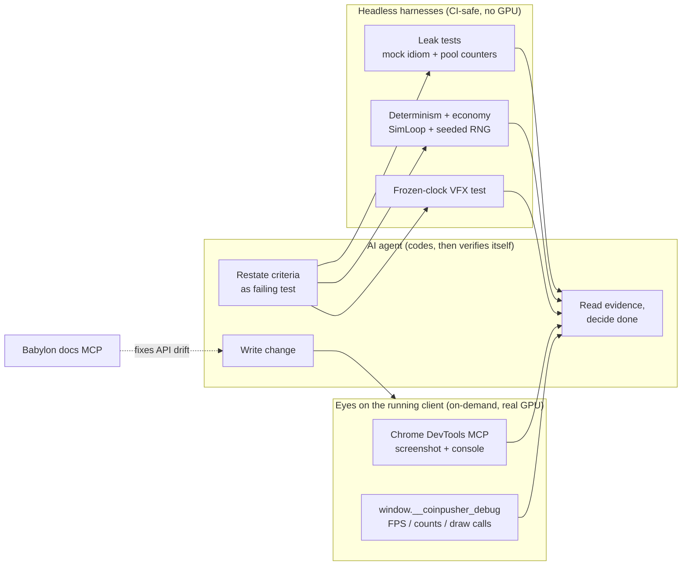
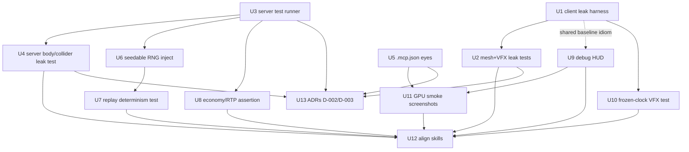

# feat: AI-Assisted Dev Feedback Loop

## Summary

Give the AI agent **eyes** (observe the running game — screenshots, console, runtime
counters) and **self-verification harnesses** (prove a change is correct headlessly,
without a human looking at the screen). This closes the feedback loop that today forces
the agent to code blind — the root cause behind spec drift, human-in-the-loop "please
eyeball this", memory leaks, and silent VFX bugs.

The work is six workstreams from the origin brief (see origin), landed as PR-sized units
in dependency order: leak tests first (highest value, fully offline), then MCP eyes, then
the determinism/economy harness, the scrapeable debug HUD, deterministic VFX checks, and
realigning the two existing skills with the built harnesses (the spec-alignment convention
they already encode).

**Scope shape decided during planning:**
- **Skills are already written and stay general.** `.agents/skills/babylon-rapier-lifecycle/SKILL.md`
  and `.agents/skills/self-verification/SKILL.md` already exist and encode *general* BabylonJS/Rapier
  conventions using this repo's files as worked examples. They reference harnesses that do not exist
  yet. This plan **builds those harnesses** and keeps the skills in sync — it does not rewrite them.
- **Harness work is project-specific** by nature (tests run against `CoinMeshManager`, `VFXManager`,
  `SimLoop`, `Coin`, etc.).
- **Seeded RNG uses the minimal path** (WS3): inject a seedable RNG only into the simulation path the
  determinism test drives (`SimLoop` + `SlotMachine` + `AbilitySimulator`). The live `GameLoop` /
  `DropScheduler` / `SponsorManager` keep `Math.random()`. Full-engine RNG injection is deferred.
- **Client leak tests use the existing mock idiom, asserting our own pool counters** (decided during
  review): match the established `vi.mock("@babylonjs/core")` tests already in
  `game/client/src/scene/__tests__/` and assert the managers' *own* counters
  (`getActiveBurstCount()`, `activeTimers`, thin-instance/pool sizes return to baseline) rather than
  raw `scene.meshes/materials/textures` totals. This catches the leak class we own (forgot-to-dispose /
  forgot-to-unpool) and avoids the canvas/shader APIs that don't load under a bare node NullEngine. The
  **server** leak test still uses real Rapier `bodies/colliders.len()` counts (no canvas dependency).

---

## Problem Frame

The agent codes blind: it cannot observe the rendered scene, the physics world state, or
resource counts, so it cannot verify its own work. That forces guessing (drift) and
human verification, and lets leaks / VFX bugs through. Fixing the *feedback loop* — not
each symptom individually — addresses all four recurring pains (drift, can't-see-the-frame,
un-recycled objects, visual-only VFX bugs).

**Non-goals (carried from origin):** no custom BabylonJS/Rapier MCP server; no golden-image
visual-regression CI gate yet; no rewrite of existing `dispose()` patterns (they're good —
we add tests that *enforce* them); no GPU in CI (headless logic/count tests; real-GPU
screenshots run locally / on-demand via MCP).

---

## Inventory Confirmed (research)

Verified against the codebase during planning — the origin inventory is accurate, with two
corrections that reshape the plan:

- **Skills already exist** (not "new"): `babylon-rapier-lifecycle/SKILL.md` (7.2K) and
  `self-verification/SKILL.md` (5.7K) are fully authored and general. They describe harnesses
  to be built here. → WS6 becomes *align*, not *author*.
- **Client/shared have vitest@^4** (`game/client/vitest.config.ts`: `environment: "node"`,
  `include: src/**/*.test.ts`, alias `@coin-pusher/shared`). **Server has neither a `test`
  script nor a vitest dependency** — it only has `tsx`. Confirmed blocker for server self-verification.
- **Client scene tests already exist** and set the idiom: `game/client/src/scene/__tests__/`
  contains `VFXManager.test.ts`, `CoinMeshManager.test.ts`, `SceneManager.test.ts`, all using
  `vi.mock("@babylonjs/core")` (mock `DynamicTexture`/`ParticleSystem`/`ShaderMaterial`) — **not**
  NullEngine. `VFXManager.test.ts` already asserts the burst-pool cap and post-`dispose()` count == 0.
  The leak tests here **extend this idiom**, they do not introduce a parallel NullEngine setup. Reason:
  the managers build `DynamicTexture` via `getContext()` + `createRadialGradient` and use
  `ToonMaterial`/`ShaderMaterial`, none of which load under a bare node NullEngine (no 2D canvas, no GL
  shader compile).
- **VFX getters:** the real methods are `getActiveBurstCount()` (line 164), `getActiveRingCount()`
  (169), `getRingPoolSize()` (173). (Origin/earlier draft said `burstSystemCount()` — that symbol does
  not exist.)
- `game/server/src/simulation/SimLoop.ts` — synchronous per-trial loop; fresh `PhysicsWorld` per
  `runTrial()`; spawns/despawns via `Coin` + `coin.destroy(physicsWorld)`.
- `game/server/src/physics/PhysicsWorld.ts` — exposes the raw `RAPIER.World` (getter at line ~55), so
  `world.bodies.len()` / `world.colliders.len()` are reachable for body/collider baselines.
- `game/client/src/scene/VFXManager.ts` — `getActiveBurstCount()` getter (line 164), pool capped at
  `maxBurstSystems` (20), `activeTimers[]` tracked, `renderObserver` stored and removed in `dispose()`.
- `game/client/src/scene/CoinMeshManager.ts` — `removeCoin(id)`, `dispose()`, thin-instance pooling.
- `game/server/src/simulation/Statistics.ts` — `TrialResult` + `rtp` / `rtpPercent` / `perTrialRTP`
  aggregation already exist; the economy assertion wires to these.
- `Math.random()` call sites: `SlotMachine.ts`, `AbilitySimulator.ts`, `SimLoop.ts` (in-scope for
  seeding) plus `GameLoop.ts`, `DropScheduler.ts`, `SponsorManager.ts` (out of scope this plan).
- `docs/decisions.md` — last ADR is **D-001**; next are **D-002**, **D-003**. Template at file bottom.

---

## High-Level Technical Design

### Feedback loop the plan builds

### Unit dependency order

---

## Key Technical Decisions

### KTD-1 — Off-the-shelf MCP, not a custom Babylon/Rapier MCP (→ ADR D-002)
Adopt **Chrome DevTools MCP** (console, network, perf, screenshots) as the agent's eyes, plus a
**Babylon docs/API-search MCP** to kill v6 API drift. Off-the-shelf + existing harnesses cover ~90%;
a custom MCP is rejected for maintenance cost. Revisit only if live scene-graph introspection is needed.

### KTD-2 — Count-baseline as the leak-test method (→ ADR D-003)
Leaks become failing tests, not lag. **Client:** extend the existing `vi.mock("@babylonjs/core")`
idiom and assert the managers' *own* pool counters (`getActiveBurstCount()`, `activeTimers.length`,
thin-instance/pool sizes) return to baseline after N spawn→despawn cycles + `dispose()`. This catches
the leak class we own (forgot-to-dispose / forgot-to-unpool) without the canvas/shader APIs that don't
load under a bare node NullEngine. **Server:** snapshot real `world.bodies.len()` /
`world.colliders.len()` (no canvas dependency), spawn+remove N coins, assert return to baseline —
requires adding vitest to the game server. Rejected: NullEngine + raw `scene.meshes/materials/textures`
counts (managers use `DynamicTexture.getContext()`/`ToonMaterial` that need a canvas polyfill to load,
and the result would measure mock bookkeeping, not real disposal); real-GPU CI (cost, flakiness);
manual eyeballing.

### KTD-3 — Minimal seeded-RNG path for determinism
Introduce a small seedable PRNG (e.g. mulberry32/xorshift — pure function, no deps) injected into
`SimLoop` → `SlotMachine` / `AbilitySimulator`. Determinism is proven for the *harness* path the test
drives. The live `GameLoop` and runtime spawners keep `Math.random()` — full-engine injection is a
broad, riskier refactor deferred to a follow-up. This bounds blast radius while satisfying WS3's
replay-determinism acceptance criterion for the simulation harness.

### KTD-4 — Babylon docs MCP choice deferred to implementation (see Open Questions)
Commit Chrome DevTools MCP immediately (low risk). Pick the Babylon docs/API MCP from the candidate
set during U5 after a quick smoke test; do not block the rest of the plan on it.

---

## Proposed ADRs (draft text to commit in U13)

> Per CLAUDE.md decision-capture protocol. Draft now, commit in U13 using the `docs/decisions.md` template.

**D-002 — Adopt off-the-shelf MCP (Chrome DevTools + Babylon docs) over a custom Babylon/Rapier MCP.**
Context: agent needs eyes on the running client; building a bespoke MCP is high-maintenance.
Decision: commit a project `.mcp.json` with Chrome DevTools MCP and a Babylon docs/API MCP.
Alternatives rejected: custom Babylon/Rapier MCP (maintenance); no MCP (agent stays blind).

**D-003 — Standardize count-baseline as the leak-test method; add vitest to the game server.**
Context: no leak tests exist; server has no test runner; client managers use canvas/shader APIs that
don't load under a bare node NullEngine. Decision: client leak tests extend the existing
`vi.mock("@babylonjs/core")` idiom and assert the managers' own pool counters; server leak tests use
real Rapier `bodies/colliders.len()` baselines; both under vitest. Alternatives rejected: NullEngine +
raw scene-count baselines on the client (needs a canvas polyfill; would measure mock bookkeeping),
real-GPU CI (cost/flakiness), manual verification (the problem we're fixing).

---

## Implementation Units

> Each unit is PR-sized and lands as its own commit/PR. U-IDs are stable.

### U1. Client leak-test harness helper (mock idiom)

**Goal:** Reusable test helpers so every client leak test shares one mock setup and one baseline idiom.
**Requirements:** WS2 (client leak infra). Foundation for U2, U10 (and the optional U9 field-shape test).
**Dependencies:** none.
**Files:**
- `game/client/src/scene/__tests__/leakHarness.ts` (new — helper)
- (read) `game/client/src/scene/__tests__/VFXManager.test.ts`, `CoinMeshManager.test.ts` (existing idiom),
  `game/client/vitest.config.ts`
**Approach:** Factor the shared `vi.mock("@babylonjs/core")` setup the existing scene tests already use
into a reusable helper, plus a `snapshotPoolCounters(manager)` util that reads the managers' own
counters (`getActiveBurstCount()`, `getActiveRingCount()`, `getRingPoolSize()`, `activeTimers.length`,
thin-instance/pool sizes) and an `expectCountersWithin(baseline, after, tolerance)` assertion. No
behavioral product code. **Do not** introduce a NullEngine setup — extend the established mock idiom.
**Patterns to follow:** existing `__tests__/VFXManager.test.ts` `vi.hoisted` mock block.
**Test scenarios:**
- Test expectation: none — pure test infrastructure. Its correctness is exercised by U2/U10.
**Verification:** `pnpm --filter @coin-pusher/client test` still passes (existing scene tests refactored
onto the helper continue to pass).

### U2. Client coin-mesh & VFX leak tests

**Goal:** Make mesh/material/texture and particle-pool leaks fail as tests.
**Requirements:** WS2 client acceptance (origin lines 88–90).
**Dependencies:** U1.
**Files:**
- `game/client/src/scene/__tests__/CoinMeshManager.leak.test.ts` (new)
- `game/client/src/scene/__tests__/VFXManager.leak.test.ts` (new)
- (read) `game/client/src/scene/CoinMeshManager.ts`, `VFXManager.ts`
**Approach:** Using the U1 mock helper, drive `CoinMeshManager` through spawn→despawn cycles via its
public state-update / `removeCoin` path (incl. key + sponsor coins); fire bursts through `VFXManager`.
Snapshot the managers' own pool counters before, act, `dispose()`, snapshot after.
**Patterns to follow:** `babylon-rapier-lifecycle` skill leak-test template; existing
`__tests__/VFXManager.test.ts` (already asserts pool cap + post-dispose count == 0).
**Test scenarios:**
- 500 spawn→despawn cycles through `CoinMeshManager` (regular + key + sponsor coins), then `dispose()`:
  the manager's tracked instance/pool counters return within ±1 of baseline; no orphaned `spawnAnims`
  or per-coin maps remain.
- 100 bursts through `VFXManager`: `getActiveBurstCount() ≤ maxBurstSystems` (20) at all times.
- After `VFXManager.dispose()`: the render observer is removed (`renderObserver` is null) and
  `activeTimers` is empty (all tracked timers cleared).
- Edge: spawn then dispose with zero despawns — no negative/orphan counts.
**Verification:** Both tests pass under `pnpm --filter @coin-pusher/client test`; deliberately skipping
an unpool/`remove` (manual spike) makes the test fail.

### U3. Add a test runner to the game server

**Goal:** Server tests can run via `pnpm test` (unblocks all server self-verification).
**Requirements:** WS2 server acceptance (origin line 94); fixes inability to run `nats/dedup.test.ts`.
**Dependencies:** none.
**Files:**
- `game/server/package.json` (add `vitest` devDep + `test`/`test:watch` scripts)
- `game/server/vitest.config.ts` (new — mirror client: `environment: "node"`, shared alias)
**Approach:** Match the client config. Confirm the existing `game/server/src/nats/dedup.test.ts` is
discovered and green. Rapier `RAPIER.init()` is async — ensure tests `await` init in setup.
**Patterns to follow:** `game/client/vitest.config.ts`.
**Test scenarios:**
- Test expectation: none for the config itself — verification is that the *existing* `dedup.test.ts`
  is discovered and passes. (Feature behavior arrives in U4/U7/U8.)
**Verification:** `pnpm --filter @coin-pusher/game test` runs and `dedup.test.ts` passes.

### U4. Server Rapier body/collider leak test

**Goal:** Physics-body leaks fail as tests.
**Requirements:** WS2 server acceptance (origin line 93).
**Dependencies:** U3.
**Files:**
- `game/server/src/physics/__tests__/coinLifecycle.leak.test.ts` (new)
- (read) `game/server/src/physics/PhysicsWorld.ts`, `Coin.ts`
**Approach:** `await physicsWorld.init()`, snapshot `world.bodies.len()` / `world.colliders.len()`,
spawn+`destroy` 1000 `Coin`s, assert return to pre-spawn baseline.
**Patterns to follow:** `Coin.destroy(physicsWorld)` (Rapier auto-removes attached colliders with the body).
**Test scenarios:**
- Spawn + remove 1000 coins: `bodies.len()` and `colliders.len()` return to baseline.
- Edge: interleaved spawn/remove (not all-then-all) still returns to baseline.
- Error: removing the same coin twice does not corrupt counts (guard or documented expectation).
**Verification:** Passes under `pnpm --filter @coin-pusher/game test`.

### U5. Commit project `.mcp.json` (the agent's eyes)

**Goal:** Any session inherits the observation tools.
**Requirements:** WS1 acceptance (origin lines 80–81).
**Dependencies:** none (independent of test units).
**Files:**
- `.mcp.json` (new, repo root)
- `CLAUDE.md` or `docs/` note: how to verify (`claude mcp list` / `/mcp`) and the clean-boot check.
**Approach:** Chrome DevTools MCP (`npx -y chrome-devtools-mcp@latest`) committed now. Add a Babylon
docs/API-search MCP after a quick smoke test (see Open Questions). Document the manual acceptance ritual.
**Patterns to follow:** origin "MCP setup (concrete)" block.
**Test scenarios:**
- Test expectation: none (config + manual ritual). Acceptance is the documented manual check below.
**Verification (manual):** `claude mcp list` shows both servers; agent can launch
`pnpm --filter @coin-pusher/client dev`, open the page, capture a screenshot, and read the console with
**zero errors** on a clean boot.

### U6. Seedable RNG injected into the simulation path

**Goal:** Make the `SimLoop` simulation path reproducible (prerequisite for replay determinism).
**Requirements:** WS3 (origin lines 99, 102) — minimal-path decision (KTD-3).
**Dependencies:** U3.
**Files:**
- `game/server/src/simulation/Rng.ts` (new — seedable PRNG, pure, no deps)
- `game/server/src/simulation/SimLoop.ts`, `SlotMachine.ts`, `AbilitySimulator.ts` (inject RNG)
- (read) `game/server/src/simulation/run.ts` (optional `--seed` flag)
**Approach:** Thread an injected `rng()` through `SimLoop` into `SlotMachine` and `AbilitySimulator`,
replacing their `Math.random()` calls. Default seed when unset preserves current behavior shape. Do
**not** touch `GameLoop`/`DropScheduler`/`SponsorManager`. Add `--seed` to `run.ts` for manual repro.
**Execution note:** Start from U7's failing determinism test, then inject RNG until it passes.
**Patterns to follow:** existing constructor-injection style in `SimLoop` (`new SlotMachine(tickRate)`).
**Test scenarios:**
- Same seed → `SlotMachine` / `AbilitySimulator` produce identical sequences across two instances.
- Different seeds → sequences differ (RNG actually varies).
- Unseeded default still runs a trial to completion (no regression in `run.ts`).
**Verification:** U7 passes; `pnpm --filter @coin-pusher/game start`-equivalent sim run via `run.ts --seed N`
reproduces.

### U7. Physics replay determinism test

**Goal:** Prove identical scripted input → identical world state on the same build.
**Requirements:** WS3 determinism acceptance (origin line 100).
**Dependencies:** U6 (RNG injection). **Note:** U6 and U7 are co-developed in one PR — the U7 test
scaffold is authored first (red), then U6 injects RNG until it passes (see U6 Execution note). The
graph edge U6→U7 reflects the *final* dependency, not the authoring order.
**Files:**
- `game/server/src/simulation/__tests__/determinism.test.ts` (new)
- `game/server/src/simulation/SimLoop.ts` (add a position-snapshot hook — see Approach)
**Approach:** `SimLoop.runTrial()` currently returns only the aggregate `TrialResult` and drains the
coins Map by trial end, so there is no per-coin state to compare. Add a lightweight snapshot hook — e.g.
an optional `onTick?: (tick, coins) => void` callback, or a `captureSnapshotAtTick(n)` option that
records each coin's position at a fixed mid-trial tick. Run two seeded trials with identical config;
compare the captured positions bitwise or within 1e-6. Run with a small `SimLoopConfig` (see U8) and an
explicit `testTimeout`.
**Test scenarios:**
- Two seeded runs, identical config: captured mid-trial coin positions equal within 1e-6 (or bitwise).
- Changing the seed changes the captured positions (guards against a no-op/over-frozen test).
- Edge: zero-coin / minimal-tick run still produces a deterministic (possibly empty) snapshot — not a
  vacuous pass on an always-empty set.
**Verification:** Passes under server vitest within the configured timeout; flake-checked over a few repeats.

### U8. Economy / RTP invariant assertion

**Goal:** Payout-logic regressions fail fast.
**Requirements:** WS3 economy acceptance (origin line 101).
**Dependencies:** U3 (independent of RNG work).
**Files:**
- `game/server/src/simulation/__tests__/economy.test.ts` (new)
- (read) `game/server/src/simulation/Statistics.ts`
**Approach:** Run N trials to aggregate `Statistics`; assert `rtpPercent` sits within an expected band
(document the band + rationale). Wire to existing `TrialResult` / `rtp` fields — no new economy logic.
**Performance note:** a full `DEFAULT_CONFIG` trial runs ~12k+ ticks and far exceeds vitest's default
5s `testTimeout`. Use a reduced `SimLoopConfig` (small `coinsPerTrial`, short `warmupSettleTicks` /
`drainTimeoutTicks`), set an explicit large `testTimeout` in the test, and pick a concrete trial count
N that keeps the run under ~30s. If N must be large to stabilize the band, mark this as an on-demand
harness (like U11) rather than a default-suite unit test.
**Test scenarios:**
- Aggregate RTP over N reduced-config trials falls within the documented band.
- A deliberately broken payout path (manual spike) pushes RTP out of band → test fails.
- Edge: zero trials / zero coins inserted does not divide-by-zero (mirror `Statistics` guards).
**Verification:** Passes under server vitest within the configured timeout.

### U9. Scrapeable debug HUD (`window.__coinpusher_debug`)

**Goal:** Turn runtime counters into ground truth the agent reads instead of asking the human.
**Requirements:** WS5 acceptance (origin lines 112–113).
**Dependencies:** none required (HUD product code is independent). Soft: reuse U1's counter-snapshot
helper in the field-shape test if it exists. Independent of server units (see server-count note below).
**Files:**
- `game/client/src/net/debugConfig.ts` (gate flag) and a new `scene/DebugReadout.ts` or extension of an
  existing debug GUI
- (read) `scene/SceneDebugGUI.ts`, `net/DebugPanel.ts`
**Approach:** When debug is enabled (existing `?debug=1` / `debugConfig` gate), expose
`window.__coinpusher_debug` with: FPS, draw calls (via `EngineInstrumentation` — `engine.drawCalls` is
not a default `Engine` property, so enable `captureGPUFrameTime`/draw-call instrumentation),
`scene.meshes.length`, active coin count, and `VFXManager.getActiveBurstCount()`. **Server body count:**
relayed only if an existing client-side field already carries it; otherwise omit it in this unit and
add it when the relay exists (keeps U9 independent of server work). Read-only snapshot object refreshed
per frame; **not** exposed when debug is off.
**Test scenarios:**
- With debug enabled, `window.__coinpusher_debug` exposes all required fields with plausible types.
- With debug disabled, `window.__coinpusher_debug` is undefined (no production surface).
- Integration: after spawning coins, `meshes.length` / active coin count reflect the change.
**Verification:** Agent reads the object via Chrome DevTools MCP (depends on U5) and asserts values; a
mock-idiom unit test covers the field-shape + gating without GPU.

### U10. Frozen-clock deterministic VFX test

**Goal:** Particle/pool state reproducible frame-to-frame.
**Requirements:** WS4 deterministic acceptance (origin line 106).
**Dependencies:** U1 (mock helper).
**Files:**
- `game/client/src/scene/__tests__/VFXManager.deterministic.test.ts` (new)
- `game/client/src/scene/VFXManager.ts` (add a fixed-`deltaTime` test hook if not already injectable)
**Approach:** Using the U1 mock helper, drive the VFX render step with a fixed `deltaTime` ("frozen
clock") and `vi.useFakeTimers()` for the `setInterval`/`setTimeout`-driven effects (lightning). Assert
deterministic **counts** — burst pool size (`getActiveBurstCount()`) and ring-pool size
(`getRingPoolSize()` / `getActiveRingCount()`) — identical at tick N across runs. Per-particle
*trajectory* is not asserted: most effects call `Math.random()` per particle, so only emission/pool
counts are reproducible without seeding the client VFX RNG (out of scope).
**Patterns to follow:** `self-verification` skill "deterministic VFX" section; existing `__tests__` mock idiom.
**Test scenarios:**
- Frozen clock + fake timers, identical burst at tick N: `getActiveBurstCount()` and ring-pool size
  equal across two runs.
- Advancing the frozen clock by the same fixed steps reproduces the same pool-size sequence.
- Edge: pool at `maxBurstSystems` stays capped under the frozen clock.
**Verification:** Passes under client vitest.

### U11. On-demand GPU smoke screenshots per ability

**Goal:** Catch "particles silently not showing" — non-empty render + zero console warnings per ability.
**Requirements:** WS4 smoke acceptance (origin line 107).
**Dependencies:** U5 (MCP eyes), U9 (HUD counters help assert non-empty render).
**Files:**
- a `docs/solutions/` note documenting the manual/on-demand ritual (matches the existing CLAUDE.md
  convention; no CI gate — GPU-in-CI is a non-goal).
**Approach:** A documented procedure: launch client dev, trigger each ability, capture a real-GPU
screenshot via Chrome DevTools MCP, assert no console warning and a non-empty render (cross-check
`__coinpusher_debug` draw calls / particle count). On-demand, not CI (GPU non-goal).
**Test scenarios:**
- Test expectation: none automated (GPU-in-CI is a non-goal). Acceptance is the documented manual ritual.
**Verification:** Following the runbook for each ability yields a non-empty screenshot and a clean console.

### U12. Align the two skills with the built harnesses

**Goal:** Keep the already-authored, general skills accurate against what now exists.
**Requirements:** WS6 (origin lines 116–117, 163–166) — *align*, since skills already exist.
**Dependencies:** U2, U4, U7, U8, U9, U10, U11.
**Files:**
- `.agents/skills/babylon-rapier-lifecycle/SKILL.md` (update leak-test template paths/idiom to match U1/U2/U4)
- `.agents/skills/self-verification/SKILL.md` (point to real `createTestScene`, server test runner,
  chosen MCP servers, frozen-clock hook, RTP assertion)
**Approach:** Diff each skill against the delivered harness; fix any reference that drifted (helper
names, file paths, MCP server names, the `--seed` flag). Keep the skills **general** (conventions +
templates), with this repo's files as worked examples — do not narrow them to coin_pusher.
**Test scenarios:**
- Test expectation: none (documentation). Verification below.
**Verification:** Every file path / helper / MCP name referenced in both SKILL.md files resolves to a
real artifact created by U1–U11.

### U13. Record ADRs D-002 and D-003

**Goal:** Capture the two non-obvious decisions per CLAUDE.md protocol.
**Requirements:** origin lines 154–159.
**Dependencies:** D-002 realized by U5; D-003 realized by U2/U3/U4. (Not U12 — skill alignment is doc
sync, not decision realization.) Per the CLAUDE.md "draft before implementing" protocol, each ADR can be
committed when its decision is realized; this unit is the backstop ensuring both land.
**Files:**
- `docs/decisions.md` (append D-002, D-003 using the file's template)
**Approach:** Commit the draft ADR text from "Proposed ADRs" above. Status `Accepted`. Number sequentially
after D-001; never reuse numbers.
**Test scenarios:**
- Test expectation: none (documentation).
**Verification:** `docs/decisions.md` contains D-002 and D-003 with Context/Decision/Alternatives/Consequences.

---

## Scope Boundaries

**In scope:** WS1–WS6 as the units above; the two ADRs; aligning (not rewriting) the existing skills.

### Deferred to Follow-Up Work
- **Full-engine seeded RNG** — inject the seedable RNG into `GameLoop`, `DropScheduler`, `SponsorManager`
  for true whole-engine bitwise determinism (riskier; touches the live loop). Separate plan.
- **Playwright MCP** for driving interactions / future visual-regression suites (origin "optional later").
- **Golden-image visual-regression CI gate** (origin non-goal v1).

### Outside this product's identity (carried from origin non-goals)
- Custom BabylonJS/Rapier MCP server.
- GPU in CI.
- Rewriting existing `dispose()` patterns.

---

## Open Questions

- **Babylon docs MCP choice (U5):** pick from the candidate set (official Babylon MCP suite;
  `immersiveidea/babylon-mcp`; `davidvanstory/babylonjs-mcp`). Resolve at implementation by smoke-testing
  the docs/API-search one first (lowest risk). Does not block other units.
- **RTP expected band (U8):** the exact acceptable RTP window + tolerance — derive from current
  `Statistics` output over a baseline run; document the chosen band and rationale in the test.
- **Server vitest + Rapier WASM:** confirm `RAPIER.init()` async setup works cleanly under vitest
  `environment: "node"` (validate in U3; fall back to a `tsx` assert script only if vitest can't load the
  SIMD WASM build — origin allowed this fallback).

---

## Risks & Dependencies

- **Rapier WASM under vitest** — the server uses the SIMD compat build; if vitest can't load it in node,
  use the origin-sanctioned `tsx` assert-script fallback for U4/U7/U8. *Mitigation:* validate early in U3.
- **Seeded-RNG behavior drift** — replacing `Math.random()` in `SlotMachine`/`AbilitySimulator` could
  shift economy numbers. *Mitigation:* default-seed path preserves distribution shape; U8's RTP band
  catches unintended drift.
- **Leak-test flakiness from async disposal** — Babylon disposal is synchronous here, but particle
  `disposeOnStop` is event-driven. *Mitigation:* drive deterministic frames in tests; assert after
  explicit `dispose()`, not after timers.
- **MCP availability** — `npx` package execution can be environment-sensitive (see prior session note on
  `rtk proxy` npx workaround). *Mitigation:* document the clean-boot verification ritual in U5.

---

## Suggested Sequencing

Per origin: **U1→U2** (client leak, highest value, fully offline) → **U3→U4** (server runner + leak,
unblocks server verification) → **U5** (eyes) → **U6→U7 / U8** (determinism + economy) → **U9** (HUD) →
**U10→U11** (VFX) → **U12** (align skills). **U13** (ADRs) is committable earlier — each ADR lands when
its decision is realized (D-002 with U5, D-003 with U2–U4). Each unit lands as its own PR:
plan → implement → `ce code review`.

---

## Sources & Research

- Origin brief: `docs/archive/brainstorms/2026-06-25-ai-dev-feedback-loop-requirements.md`
- Verified files: `game/server/src/simulation/SimLoop.ts`, `Statistics.ts`, `run.ts`,
  `game/server/src/physics/PhysicsWorld.ts`, `Coin.ts`,
  `game/client/src/scene/CoinMeshManager.ts`, `VFXManager.ts`, `net/debugConfig.ts`,
  `game/client/vitest.config.ts`, `game/{server,client,shared}/package.json`,
  `.agents/skills/{babylon-rapier-lifecycle,self-verification}/SKILL.md`, `docs/decisions.md`.
- No external research run — all patterns are local and well-established; MCP package names come from the
  origin brief and are smoke-tested at U5.
