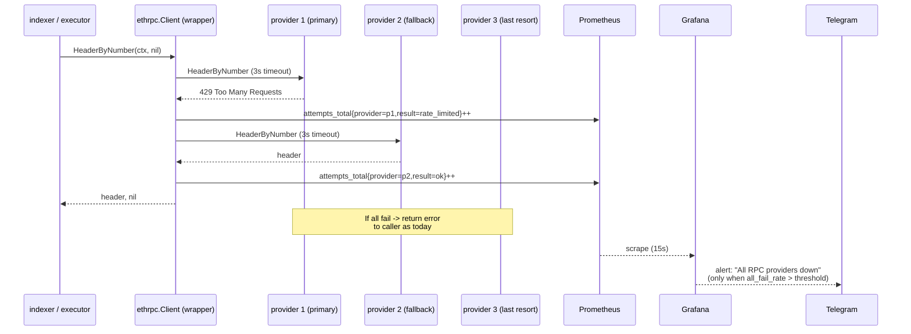

# Multi-provider RPC fallback for indexer/executor + Telegram alerts

## Overview

Production indexer has been 100% dead for ~33 hours (first 429: `2026-04-22 23:16:24 UTC`, 49,138 consecutive failed polls) because the Alchemy RPC key's monthly quota was exhausted. Both `indexer` and `executor` are hard-wired to a **single** RPC endpoint via `ethclient.Dial`, so any provider outage becomes a total outage — the container still reports "Up" while processing zero deposits, so there is no signal to oncall.

This plan adds a small multi-provider RPC client abstraction, wires both services to it with per-service priority order, and hooks failure signals into the existing Grafana → Telegram alerting path so future outages page immediately.

## Problem Frame

- `backend/app/tooling/indexer/main.go:51` and `backend/app/tooling/executor/main.go:54` each declare a single `RPCURL string` config field. `ethclient.Dial` is called exactly once per service (`indexer/main.go:185`, `executor/main.go:235`).
- `docker-compose.services.yml` injects `ALCHEMY_RPC_URL` as `BACKEND_INDEXER_RPCURL`, so the only prod RPC is Alchemy. When Alchemy returned 429s at 2026-04-22 23:16 UTC the indexer entered a permanent poll-error loop. Because `pollOnce` returns an error without advancing the cursor (`indexer/main.go:356-360`), cursor correctly stalled — once RPC recovers the indexer will back-fill the gap automatically.
- No test for "RPC provider unavailable". No alert fires on 429 storms. Alchemy 429s appear only as generic `poll error` log lines.
- Telegram alerting is already wired end-to-end: `deploy/grafana/provisioning/alerting/contact-points.yml` defines the Telegram receiver, `notification-policies.yml` routes all severities there, and `alerts.yml` (36KB) holds existing rules. Adding new rules is a config edit, not new infrastructure.
- Executor (withdrawals + sweeps) has the identical single-RPC design. It has not triggered yet because withdrawals are lower-frequency and Alchemy didn't quota out during a withdrawal window, but it is the same latent SPOF on money flow.

## Requirements Trace

- **R1**: Indexer survives any single RPC provider outage (429, timeout, network error) and continues processing blocks with <30s added latency.
- **R2**: Executor survives any single RPC provider outage without dropping or double-submitting withdrawals.
- **R3**: Per-service provider priority:
  - Indexer: `1) mainnet.base.org (public)  2) Alchemy  3) Ankr`
  - Executor: `1) Alchemy  2) Ankr` (public RPC intentionally excluded — write path needs reliable `SendTransaction`)
- **R4**: When all providers fail, operators receive a Telegram alert within 5 minutes of the first failure storm.
- **R5**: When block lag exceeds threshold (indexer falling behind), operators receive a Telegram alert.
- **R6**: The 33-hour missed-deposit window must auto-recover: after fix, cursor should advance from its stall point through current tip, crediting all skipped deposits without manual backfill.
- **R7**: Individual provider health must be observable in Grafana (which provider is primary-carrying vs fallback-carrying).

## Scope Boundaries

**In scope:**
- Multi-provider fallback in `indexer` and `executor`.
- Immediate env hotfix to unblock the 33-hour backlog.
- New Prometheus metrics for per-provider success/failure.
- New Grafana alert rules routed through the existing Telegram receiver.

**Out of scope (explicit non-goals):**
- Switching RPC providers as a product (e.g., moving off Alchemy entirely).
- WebSocket subscription fallback (current code uses HTTP polling only).
- Parallel/racing multi-provider calls (we use sequential failover — simpler and sufficient).
- Caching or deduplicating RPC calls.
- Rewriting the alerting stack (Grafana Unified Alerting is already deployed and fine).
- Replaying / reconciling any deposits the indexer missed — current code already does this automatically because cursor stalled on failure.

## Context & Research

### Relevant Code and Patterns

- `backend/app/tooling/indexer/main.go` — single-provider dial at line 185; poll loop at 237; `pollOnce` at 251; cursor save at 374.
- `backend/app/tooling/executor/main.go` — single-provider dial at line 235; RPC methods called: `HeaderByNumber`, `PendingNonceAt`, `SuggestGasTipCap`, `EstimateGas`, `SendTransaction`, `CallContract`, `BalanceAt`, `TransactionReceipt`.
- `backend/foundation/` — target home for the new `ethrpc/` package; follows existing `database/`, `logger/`, `wallet/`, `ethereum/` subpackage pattern.
- `backend/foundation/ethereum/` exists and holds pure utility helpers — the new `ethrpc` package is deliberately separate because it holds stateful dial + fallback logic.
- `docker-compose.services.yml` — `indexer:` block lines that wire `BACKEND_INDEXER_RPCURL` via `${ALCHEMY_RPC_URL:-https://mainnet.base.org}`.
- `deploy/grafana/provisioning/alerting/alerts.yml` — existing Grafana alert rules; follow the existing YAML shape for new rules.
- `deploy/grafana/provisioning/alerting/contact-points.yml` — Telegram contact point, already live, already using `${TELEGRAM_BOT_TOKEN}` / `${TELEGRAM_CHAT_ID}` env vars.
- `deploy/grafana/provisioning/alerting/notification-policies.yml` — all severities already route to `telegram`.
- Existing metrics convention: `coinpusher_<service>_<metric>` (see `indexerRPCLatency`, `executorRPCLatency`).

### Institutional Learnings

- `docs/solutions/integration-issues/batch-insert-outbox-2026-04-14.md` is unrelated but reinforces the pattern: silent failure at the infrastructure boundary without an alert is the project's recurring failure mode.
- From this session's investigation: container status "Up" is a dangerously misleading health signal when a poll loop retries forever without crashing. Any new external-dependency integration in this codebase should include an alert on "sustained error rate" rather than relying on container health.

### External References

- Alchemy 429 semantics — `Retry-After` header may or may not be present; treat all 429s as "swap provider, don't sleep the current provider".
- Ankr Premium RPC — per-chain path (`/base/<key>`); supports same JSON-RPC method set as Alchemy for Base.
- `go-ethereum/ethclient` exposes methods we need as direct calls on `*ethclient.Client`; wrapper is straightforward because both services only use a small method subset.

## Key Technical Decisions

- **Sequential failover, not parallel races.** Simpler code, predictable cost, avoids double-submit risk for `SendTransaction`. Tradeoff: worst-case latency = sum of per-provider timeouts. Mitigated by a short per-call timeout (3s).
- **Wrap `*ethclient.Client`, don't replace `rpc.Client`.** A thin Go struct that holds `[]*ethclient.Client` and re-implements only the ~9 methods we actually call. Matches existing call sites with zero interface churn.
- **Dial eagerly at startup, not per-call.** If any provider URL is unreachable at boot the service logs a warning but continues as long as at least one dials successfully. Full-boot failure (zero providers dial) exits non-zero.
- **Public RPC excluded from executor.** Write-path (`SendTransaction`) through a shared public endpoint is unreliable; dropped or stuck broadcasts on withdrawals are a worse failure than a short outage.
- **Config shape: comma-separated string, not list type.** Keeps `ardanlabs/conf` usage consistent with existing fields; single env var is easier to manage via compose interpolation.
- **Retry policy: on 429 / network error / timeout, advance to next provider without retrying the failing one.** Retrying Alchemy after a 429 just burns more quota.
- **Metric per provider, not per-call.** Counter `coinpusher_rpc_attempts_total{service, provider, method, result}` — low-cardinality enough that Prometheus can handle it, rich enough for Grafana to show "which provider carried load".
- **Telegram alert routing uses existing Grafana Unified Alerting.** No Alertmanager needed; existing `contact-points.yml` + `notification-policies.yml` route all rules to Telegram.
- **Hotfix first, code fix later.** Unit 1 is purely an ops env swap that should happen immediately (outside of plan execution) to unblock the 33-hour backlog. Subsequent units harden so this can never happen silently again.

## Open Questions

### Resolved During Planning

- **Which RPC methods need wrapping?** `HeaderByNumber`, `FilterLogs`, `PendingNonceAt`, `SuggestGasTipCap`, `EstimateGas`, `SendTransaction`, `CallContract`, `BalanceAt`, `TransactionReceipt`, plus `ChainID` (executor calls `types.NewLondonSigner(baseChainID)` from config, not RPC, so chain id is not RPC-bound). Confirmed by grep of both services.
- **Does Grafana already have Telegram?** Yes (`deploy/grafana/provisioning/alerting/contact-points.yml`). No new infrastructure.
- **Will the 33h of missed deposits be recovered automatically?** Yes. `pollOnce` returns error without advancing cursor (`indexer/main.go:366` only advances after full success); once RPC is restored, indexer resumes from the stalled block and processes forward through `FilterLogs` range windows. No manual backfill needed.
- **Public RPC for executor?** No. Decided to exclude.

### Deferred to Implementation

- Exact per-call RPC timeout value (starting guess: 3s per provider; may tune after observing p99 under real traffic).
- Whether `FilterLogs` over a large catch-up range (post-33h backlog) stresses `mainnet.base.org` enough to force fallback on the first poll after restore — if so, may want `BACKEND_INDEXER_BLOCK_RANGE` temporarily smaller during catch-up.
- Final Grafana alert firing thresholds (initial guesses in Unit 6, will tune after 1 week of baseline data).
- Whether Ankr's `/base/<key>` endpoint enforces per-method CU weights differently enough to warrant per-provider rate limits (unlikely but worth watching).

## High-Level Technical Design

> *This illustrates the intended approach and is directional guidance for review, not implementation specification. The implementing agent should treat it as context, not code to reproduce.*

### Call flow (after this plan ships)



### Wrapper shape (pseudo-code, directional only)

```
type Client struct {
  providers []provider  // {name, *ethclient.Client, url_masked}
  timeout   time.Duration
  log       *zap.SugaredLogger
  service   string      // "indexer" or "executor" — for metric label
}

// Every wrapped method follows this pattern:
func (c *Client) HeaderByNumber(ctx, n) (*types.Header, error) {
  for each provider in c.providers:
     ctx2 := withTimeout(ctx, c.timeout)
     h, err := provider.client.HeaderByNumber(ctx2, n)
     metrics.attempts.WithLabels(c.service, provider.name, "HeaderByNumber", resultLabel(err)).Inc()
     if err == nil: return h, nil
     log.Warnw("rpc fallback", service, provider.name, method, err)
  return nil, fmt.Errorf("all providers failed: last err: %w", err)
}
```

*This is structural guidance. The implementer should decide on helper extraction (e.g., a generic `call[T]` helper) based on what reads cleanest in real Go code.*

## Implementation Units

- [ ] **Unit 1: Immediate production hotfix (ops-only)**

**Goal:** Unblock the 33-hour deposit backlog by pointing prod indexer at the public RPC. Pure env change, no code. Do this **before** starting the code work; the rest of the plan hardens so it cannot happen silently again.

**Requirements:** R6

**Dependencies:** None.

**Files:**
- Modify on prod droplet only: `/opt/coin_pusher/.env` (not committed to repo)

**Approach:**
- Change the compose-read env variable so `indexer` boots against public RPC.
- Option A: Swap `ALCHEMY_RPC_URL` to `https://mainnet.base.org`.
- Option B (preferred): Add `INDEXER_RPCURL_OVERRIDE=https://mainnet.base.org` and temporarily edit `docker-compose.services.yml` indexer block to read it. Pick whichever requires fewer changes — compose is source-controlled so any edit must land in the repo too.
- `docker compose -f docker-compose.services.yml up -d indexer`.
- Tail logs and watch cursor advance back through the stalled blocks. `coinpusher_indexer_block_lag` should fall toward zero over minutes (not hours) because `BLOCK_RANGE=10` × polls/sec is conservative.

**Execution note:** This is ops work, not a code change. It is captured here as Unit 1 so the plan's checklist reflects the full remediation sequence.

**Patterns to follow:** None — single env swap.

**Test scenarios:** *Test expectation: none — ops-only hotfix. Verified by observation.*

**Verification:**
- `docker logs coin_pusher-indexer-1 --tail 100` shows zero 429s for 2 minutes.
- `coinpusher_indexer_block_lag` Prometheus gauge trends toward 0.
- `coinpusher_indexer_deposits_processed_total` increments (confirms any queued deposits in the window got processed).
- DB spot-check: `SELECT COUNT(*) FROM deposit_transactions WHERE created_at > '2026-04-22 23:00:00'` shows non-zero if any deposits occurred during the outage.

---

- [ ] **Unit 2: Build `backend/foundation/ethrpc/` multi-provider client**

**Goal:** Create a small reusable package that takes an ordered list of RPC endpoints, dials each at construction, and routes each method call through providers in order, falling back on error.

**Requirements:** R1, R2, R7

**Dependencies:** None (self-contained package).

**Files:**
- Create: `backend/foundation/ethrpc/client.go` — exported `Client` struct, constructor `New`, wrapped methods.
- Create: `backend/foundation/ethrpc/metrics.go` — Prometheus counter for per-provider attempts, plus `labelForErr` helper classifying errors into `ok` / `rate_limited` / `timeout` / `network` / `other`.
- Create: `backend/foundation/ethrpc/client_test.go` — unit tests with a mocked `ethclient`-shaped interface or an httptest server returning canned responses.

**Approach:**
- Constructor signature: `New(ctx, log, service string, urls []string, timeout time.Duration) (*Client, error)`.
  - `service` label: `"indexer"` or `"executor"`. Drives metric labels.
  - Dial each url; if zero succeed, return error. If some fail, log warning and continue with the successful ones.
  - Provider name = derived from URL host (e.g., `base-mainnet.g.alchemy.com` → `alchemy`, `rpc.ankr.com` → `ankr`, `mainnet.base.org` → `public`). Hardcode a small lookup map + fallback to "other".
  - Mask URLs in all logs — API keys are in the path. Never log the raw URL after startup.
- Wrapped methods (one per signature the two services use):
  - `HeaderByNumber(ctx, *big.Int)`
  - `FilterLogs(ctx, ethereum.FilterQuery)`
  - `PendingNonceAt(ctx, common.Address)`
  - `SuggestGasTipCap(ctx)`
  - `EstimateGas(ctx, ethereum.CallMsg)`
  - `SendTransaction(ctx, *types.Transaction)`
  - `CallContract(ctx, ethereum.CallMsg, *big.Int)`
  - `BalanceAt(ctx, common.Address, *big.Int)`
  - `TransactionReceipt(ctx, common.Hash)`
- Every method body follows one pattern: per-call timeout wrap, loop providers, record metric, fall through on error, return success immediately.
- Error classification for metrics:
  - `ok` — nil
  - `rate_limited` — HTTP 429 (string match on error, go-ethereum surfaces this as text)
  - `timeout` — `context.DeadlineExceeded`
  - `network` — `net.Error` that is not timeout
  - `other` — everything else (returned JSON-RPC errors, unmarshalling failures)
- Return the **last** provider's error when all fail, wrapped with `fmt.Errorf("all %d providers failed for %s: last: %w", n, method, err)` so callers can still `errors.Is`.
- Do **not** add retry-with-backoff inside the wrapper. Callers (indexer poll loop, executor batch loop) already handle retry via their next tick.
- Expose `Close()` to close all underlying clients on shutdown.

**Execution note:** Start with a failing test for the "primary 429 → fallback succeeds" scenario. Build the minimum wrapper that makes it pass, then expand coverage.

**Patterns to follow:**
- `backend/foundation/database/` — constructor returning error, `Close()` shape.
- `backend/foundation/logger/` — uses `zap.SugaredLogger`.
- Existing `promauto.NewCounter` convention in `indexer/main.go:75-96`.

**Test scenarios:**
- Happy path: primary returns success → caller gets value, metric shows `result=ok, provider=<primary>`, no fallback invoked, no warn log.
- Happy path: two providers configured, primary succeeds consistently → fallback never called (verified by counting attempts).
- Fallback on 429: primary returns error matching `429` string → fallback provider called → caller gets value from fallback → metrics show `rate_limited` on primary and `ok` on fallback → warning log emitted.
- Fallback on timeout: primary hangs longer than per-call timeout → `context.DeadlineExceeded` → fallback called → metric `timeout` on primary.
- Fallback on network error: primary returns `dial tcp: connection refused` → metric `network` on primary, `ok` on fallback.
- All providers fail: three providers all return 429 → caller gets combined error referencing last provider → 3 attempts recorded → error classified (not panic).
- Constructor — zero valid URLs → error returned, no client constructed.
- Constructor — one of three URLs fails to dial → Client returns success with 2 providers, warning logged, count of providers exposed via test-only helper or metric.
- Constructor — URL with API key in path → log output scrubbed (assert on captured log that the key substring does not appear).
- Context cancellation by caller: caller cancels ctx mid-call → wrapper returns immediately, does not continue to fallback, does not record `timeout` metric against any untried provider.
- Edge case: `SendTransaction` on primary returns "already known" / "nonce too low" (not a 429 / timeout / network error) → per decision above, this is classified `other` and we **do** fall through. (Document in code comment that this means a tx may hit multiple providers; safe because signed tx is idempotent on `nonce too low`, but note the risk in the doc comment for future readers.)
- Error wrapping: caller can `errors.Is(err, context.DeadlineExceeded)` when all-fail reason was timeout.

**Verification:**
- `go test ./backend/foundation/ethrpc/...` passes.
- Coverage includes every wrapped method at least once.
- No raw API keys in any emitted log line (grep test assertion).

---

- [ ] **Unit 3: Wire indexer to use `ethrpc.Client`**

**Goal:** Replace the single-provider `ethclient.Dial` in `indexer/main.go` with `ethrpc.New`, change config to accept multiple URLs, preserve existing behavior when only one URL is configured.

**Requirements:** R1, R3, R7

**Dependencies:** Unit 2.

**Files:**
- Modify: `backend/app/tooling/indexer/main.go`
- Modify: `backend/app/tooling/indexer/main_test.go` — if absent, create minimal test asserting config parsing of multi-URL env var. *(Check repo first — may not exist; in that case add one.)*

**Approach:**
- Replace `RPCURL string` config field with `RPCURLs string` (comma-separated). Keep a `RPCTimeout time.Duration` field with sensible default (3s).
- Parse the CSV into `[]string`, trim whitespace, drop empties.
- Replace `ethclient.Dial` with `ethrpc.New(ctx, log, "indexer", urls, cfg.Indexer.RPCTimeout)`.
- `pollOnce` signature takes `*ethrpc.Client` instead of `*ethclient.Client`. Method calls are unchanged.
- Log startup line should list provider names (from the client), not URLs.
- Remove / repurpose the existing single-purpose `indexerRPCLatency` histogram only if it becomes redundant with the new `coinpusher_rpc_attempts_total` metric. Initial guidance: **keep it**; the histogram is still useful because attempts counter only records success/fail outcome, not duration.

**Execution note:** Not test-first for the main.go wiring (it's mostly type substitution). Do write the config-parsing test first.

**Patterns to follow:**
- Existing `conf.Parse` usage at `indexer/main.go:109`.
- Existing log field style at `indexer/main.go:191-194`.

**Test scenarios:**
- Happy path: config with single URL parses into single-element slice, constructs Client, indexer runs its poll loop without behavior change from today.
- Happy path: config with three comma-separated URLs parses into 3 providers in listed order.
- Config parsing: whitespace around commas tolerated; trailing comma tolerated; empty entries dropped.
- Config parsing: all-empty or missing value returns startup error with clear message.
- Integration: under a stub ethrpc.Client whose primary always returns 429, indexer's `pollOnce` still completes successfully via fallback (optional — can be covered by Unit 2 tests instead).

**Verification:**
- `go build ./backend/app/tooling/indexer/` succeeds.
- `go test ./backend/app/tooling/indexer/...` passes.
- Running indexer locally against a bad primary + good fallback processes blocks.

---

- [ ] **Unit 4: Wire executor to use `ethrpc.Client`**

**Goal:** Same as Unit 3, for executor. Provider order: Alchemy → Ankr. No public RPC.

**Requirements:** R2, R3

**Dependencies:** Unit 2.

**Files:**
- Modify: `backend/app/tooling/executor/main.go`
- Modify: `backend/app/tooling/executor/main_test.go` — if present, adjust config tests. If absent, add minimal config parsing test.

**Approach:**
- Same config surgery as Unit 3: `RPCURL` → `RPCURLs` + `RPCTimeout`.
- Replace `ethclient.Dial` at line 235 with `ethrpc.New(ctx, log, "executor", urls, cfg.Executor.RPCTimeout)`.
- All helper functions that take `*ethclient.Client` (grep result showed 7 call sites) change to `*ethrpc.Client`. Method signatures on the wrapper match go-ethereum's, so bodies don't change.
- Double-check `SendTransaction` call paths — confirm they're idempotent under double-submission. Current code signs tx with a specific nonce, so submitting the same signed tx to two providers results in the second one returning "already known" / "nonce too low"; caller treats that as failure in exactly one place (`executor/main.go:649, 865, 957`) — ensure that path handles it. See Unit 2's `SendTransaction` test scenario: we chose to fall through on non-429/timeout errors, which means a transient network blip on the primary could cause both providers to broadcast. This is acceptable because Ethereum tx replay is idempotent on a signed tx, but add a `log.Infow("tx submitted via fallback", ...)` line so operators can see it.

**Execution note:** Characterization-safe — before changing any signature, confirm executor tests exist and pass; if none exist, add one integration-style test that exercises a fake chain (or skip and rely on careful review + staging deploy).

**Patterns to follow:**
- Same as Unit 3.

**Test scenarios:**
- Config parses multi-URL correctly.
- `SendTransaction` on primary succeeds → no fallback.
- `SendTransaction` on primary returns network error → fallback called → second provider succeeds → caller sees success, sees one info log for "tx submitted via fallback".
- `PendingNonceAt` primary 429 → fallback returns nonce → caller unaffected.
- `TransactionReceipt` not-yet-mined scenarios still work (receipt `nil` + `ethereum.NotFound` is handled correctly by the wrapper — it is **not** an error for fallback purposes; waitForReceipt loops anyway).

**Verification:**
- `go build ./backend/app/tooling/executor/` succeeds.
- `go test ./backend/app/tooling/executor/...` passes.
- Staging smoke test: one manual withdrawal end-to-end with Alchemy key blanked → fallback path exercised.

---

- [ ] **Unit 5: Production env + docker-compose wiring**

**Goal:** Ship the new multi-provider config to prod. Point indexer at public→Alchemy→Ankr and executor at Alchemy→Ankr. Replace Unit 1's hotfix with the proper config.

**Requirements:** R3, R6

**Dependencies:** Unit 3, Unit 4.

**Files:**
- Modify: `docker-compose.services.yml` — `indexer` and `executor` blocks.
- Modify on prod droplet: `/opt/coin_pusher/.env` — add `BASE_PUBLIC_RPC_URL`, `ANKR_RPC_URL`, keep `ALCHEMY_RPC_URL`. Not committed.
- Modify (template): `.env.example` if present, to document new variables.

**Approach:**
- `.env` additions (production droplet):
  ```
  BASE_PUBLIC_RPC_URL=https://mainnet.base.org
  ALCHEMY_RPC_URL=https://base-mainnet.g.alchemy.com/v2/<key>
  ANKR_RPC_URL=https://rpc.ankr.com/base/19e70c34c8fc92540a862131da21006016f297ae9cc59bae8deeed29df4e5cd1
  ```
- `docker-compose.services.yml` — indexer block:
  ```yaml
  BACKEND_INDEXER_RPCURLS: "${BASE_PUBLIC_RPC_URL},${ALCHEMY_RPC_URL},${ANKR_RPC_URL}"
  BACKEND_INDEXER_RPCTIMEOUT: "3s"
  ```
  and remove the old `BACKEND_INDEXER_RPCURL` line.
- `docker-compose.services.yml` — executor block (create/locate):
  ```yaml
  BACKEND_EXECUTOR_RPCURLS: "${ALCHEMY_RPC_URL},${ANKR_RPC_URL}"
  BACKEND_EXECUTOR_RPCTIMEOUT: "3s"
  ```
- Rollout order on prod:
  1. Pull latest code (Units 2-4).
  2. Edit `.env` — add the three URL vars. **Do not commit.**
  3. Edit `docker-compose.services.yml` — replace env blocks.
  4. `docker compose -f docker-compose.services.yml build indexer executor`.
  5. `docker compose -f docker-compose.services.yml up -d indexer executor`.
  6. Tail logs, verify startup line lists all three providers for indexer, two for executor.
  7. Verify `coinpusher_rpc_attempts_total{service="indexer",provider="public"}` increments.

**Patterns to follow:**
- Existing compose env injection pattern at `docker-compose.services.yml` indexer block (`${VAR:-default}`).

**Test scenarios:** *Test expectation: none — config change. Verified by deploy observation.*

**Verification:**
- `docker compose config` (dry-run) renders without error and shows expected env var values.
- Indexer log line on startup: `"indexer starting" providers=["public","alchemy","ankr"]`.
- Executor log line: `"executor starting" providers=["alchemy","ankr"]`.
- After deploy, `coinpusher_rpc_attempts_total` shows traffic distributed as expected (primary carries ~100% when healthy; fallbacks stay at 0 until primary degrades).
- Manually simulate Alchemy outage in staging by revoking the key → metrics show fallback carrying load; no user-visible impact.

---

- [ ] **Unit 6: Grafana alert rules for RPC health**

**Goal:** Make an RPC outage page someone within 5 minutes. Add alert rules to the existing Grafana Unified Alerting config; rules route through the already-configured Telegram contact point.

**Requirements:** R4, R5, R7

**Dependencies:** Unit 2 (for the new metric) + Unit 5 (deployed).

**Files:**
- Modify: `deploy/grafana/provisioning/alerting/alerts.yml`

**Approach:**
- Add a new rule group `rpc_health` to `alerts.yml`.
- Rules to add:
  1. **IndexerAllProvidersDown** — critical. Expression: `sum by (service) (rate(coinpusher_rpc_attempts_total{service="indexer",result="ok"}[5m])) == 0 AND sum by (service) (rate(coinpusher_rpc_attempts_total{service="indexer"}[5m])) > 0`. For: 2m. Summary: "Indexer: all RPC providers failing". Severity label: `critical`.
  2. **ExecutorAllProvidersDown** — critical. Same logic with `service="executor"`. For: 2m.
  3. **IndexerBlockLagHigh** — warning. Expression: `coinpusher_indexer_block_lag > 100`. For: 5m. Summary: "Indexer is >100 blocks behind chain tip".
  4. **IndexerBlockLagCritical** — critical. Expression: `coinpusher_indexer_block_lag > 500`. For: 2m. Summary: "Indexer is >500 blocks behind — possible deposit loss window".
  5. **RPCProviderDegraded** — warning. Expression: per-provider failure rate > 20% over 10m, excluding `result=ok`. For: 10m. Summary: "RPC provider {{ $labels.provider }} degraded on {{ $labels.service }}". Purpose: know *which* provider is sick before all of them fall over.
  6. **IndexerNoDepositsInWindow** — informational (optional). Expression: `rate(coinpusher_indexer_deposits_processed_total[6h]) == 0`. For: 6h. Purpose: catch the case where the indexer is processing blocks but a deposit-handling bug means zero deposits get credited. (Consider deferring if noisy.)
- Alerts labeled `severity=critical` already route to Telegram per `notification-policies.yml`. `severity=warning` also routes there. Nothing to do in policies.
- Telegram message template should include service, provider (when applicable), and a link to the Grafana dashboard. Existing alert rules in `alerts.yml` likely already define a template — follow their shape.

**Patterns to follow:**
- Existing rules in `deploy/grafana/provisioning/alerting/alerts.yml` (36KB — large, follow existing structure precisely).
- `contact-points.yml` Telegram config (no changes needed).

**Test scenarios:** *Test expectation: none — config only. Verified in staging by forcing each alert condition and confirming Telegram delivery.*

**Verification:**
- `docker compose up -d grafana` reloads provisioning without YAML errors.
- Grafana UI → Alerting → Alert rules shows all 5–6 new rules under `rpc_health`.
- Staging test: stop the indexer container for 3 minutes → `IndexerAllProvidersDown` fires → Telegram message arrives.
- Staging test: set `BACKEND_INDEXER_RPCTIMEOUT=1ms` → all providers timeout → same alert fires, different severity path.
- Staging test: pause block processing by pointing at a stale RPC → `IndexerBlockLagHigh` fires after 5m.
- `IndexerAllProvidersDown` does **not** fire when indexer is simply idle (no polls happening) — confirmed by the `AND rate(total)[5m] > 0` guard.

## System-Wide Impact

- **Interaction graph:** `indexer` and `executor` are the only current consumers of `foundation/ethrpc/`. No other service talks to Ethereum RPC today. New metric name `coinpusher_rpc_attempts_total` is additive — no existing Prometheus scraper config changes needed.
- **Error propagation:** RPC failures surface to callers as Go errors with the same semantics as `ethclient` today (nil on success, error on all-provider-fail). `errors.Is(err, context.DeadlineExceeded)` continues to work. No new error types forced on callers.
- **State lifecycle risks:** `SendTransaction` broadcast to multiple providers on unusual errors is the one real risk. Mitigated by: signed txs are idempotent at the network level (same tx hash = same inclusion), and the current error path already handles "nonce too low" / "already known". Adding explicit classification for this case is a Unit 4 test scenario.
- **API surface parity:** Indexer's HTTP metrics endpoint (`:9091/metrics`) and executor's metrics endpoint both continue to work unchanged — they just expose additional new counters.
- **Integration coverage:** Unit tests (Unit 2) plus staging deploy smoke test (Units 5, 6) cover the full path. No production-only verification needed for the code itself.
- **Unchanged invariants:** The "cursor does not advance past failed deposits" rule at `indexer/main.go:356-360` is preserved untouched — this is what made the 33h outage recoverable in the first place, and nothing in this plan changes that contract. Executor's advisory-lock singleton behavior (`advisoryKeyExecutor` in `executor/main.go:72`) is also unchanged.

## Risks & Dependencies

| Risk | Mitigation |
|------|------------|
| `SendTransaction` broadcast to multiple providers causes duplicate-submission error logs | Signed tx replay is idempotent; document in code + test scenario in Unit 4; surface via `log.Infow("tx submitted via fallback", ...)` so it's visible but not scary |
| Public RPC rate limits cause indexer to fall back to Alchemy constantly, burning quota anyway | Acceptable — user explicitly chose this priority order. Mitigation: Unit 6 alert `RPCProviderDegraded` surfaces this pattern quickly so we can reorder if needed |
| Large catch-up `FilterLogs` after 33h stall rejected by public RPC (too many blocks) | Cursor stays stalled; fallback takes over. Can temporarily lower `BACKEND_INDEXER_BLOCK_RANGE` during catch-up if observed |
| Ankr key leakage in logs | Address in Unit 2 (URL masking); grep test asserts no raw key in captured logs |
| New metric cardinality explosion | Bounded: `service` × `provider` × `method` × `result` ≈ 2 × 3 × 9 × 5 = 270 series max. Acceptable |
| Provisioning YAML syntax error breaks all Grafana alerts | Test in staging first; `alerts.yml` is large, easy to miss a nesting error. Lint with `promtool check rules` equivalent or run staging Grafana on the file before prod rollout |
| Telegram bot token rotation invalidates alerts silently | Out of scope for this plan but worth a follow-up checklist item |
| Executor's fallback-on-non-429 behavior broadcasts tx twice on transient primary error | Called out explicitly in Unit 2 test scenario and Unit 4 verification. Idempotent at network level. Acceptable risk given simplicity gain |

## Documentation / Operational Notes

- Update `docs/solutions/` with a new entry `rpc-fallback-2026-04-24.md` after landing, covering: what broke, how the fallback works, how to add a fourth provider in the future, how to interpret `coinpusher_rpc_attempts_total`.
- Update any ops runbook that mentions `ALCHEMY_RPC_URL` to reference the new `BACKEND_INDEXER_RPCURLS` / `BACKEND_EXECUTOR_RPCURLS` shape.
- Update Grafana dashboard for indexer/executor to add a "RPC provider mix" panel driven by the new counter.
- Save a reminder to revisit provider order after 2 weeks of production data — the initial choice of public-first for indexer is a tradeoff that may prove cost-right or stability-wrong.

## Sources & References

- `backend/app/tooling/indexer/main.go` (indexer entry point, single-RPC site)
- `backend/app/tooling/executor/main.go` (executor entry point, single-RPC site)
- `docker-compose.services.yml` (compose env wiring)
- `deploy/grafana/provisioning/alerting/alerts.yml` (target for new rules)
- `deploy/grafana/provisioning/alerting/contact-points.yml` (existing Telegram receiver)
- `deploy/grafana/provisioning/alerting/notification-policies.yml` (routing already covers all severities)
- Production log evidence: first 429 at `2026-04-22 23:16:24 UTC`, 49,138 consecutive failures, 100% failure rate for ~33h — captured from `docker logs coin_pusher-indexer-1`
- Ankr Base endpoint: `https://rpc.ankr.com/base/19e70c34c8fc92540a862131da21006016f297ae9cc59bae8deeed29df4e5cd1`
