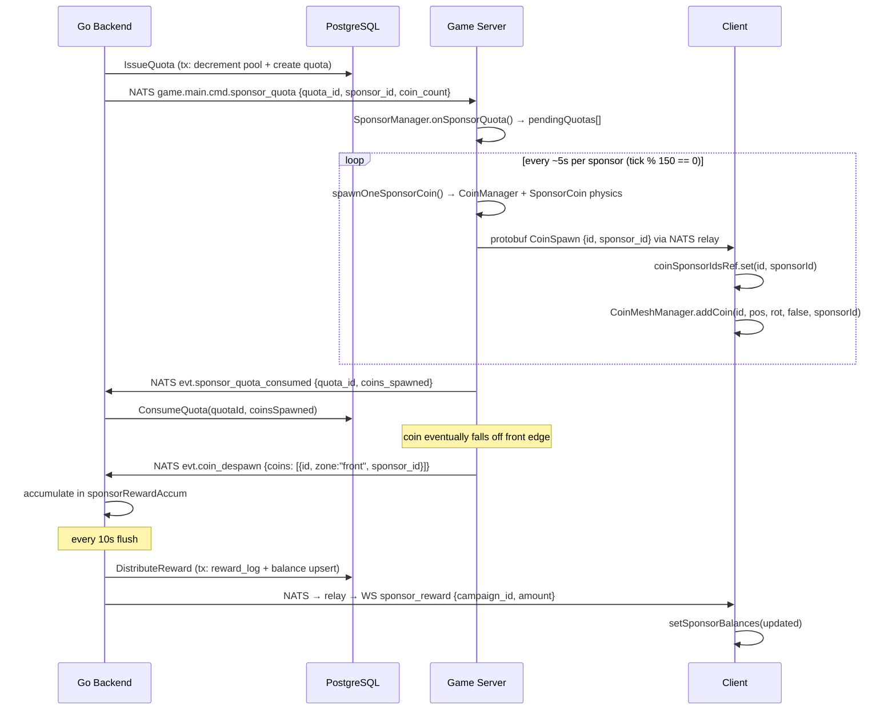
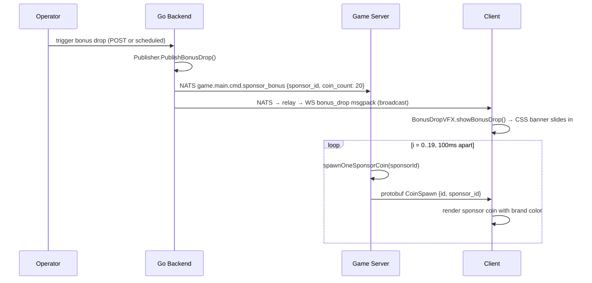

# 無許可贊助廣告系統 — 技術指南

**版本：** v1 (2026-03-29)
**讀者：** 加入推幣機專案的資深開發人員
**狀態：** 啟用中（已實作）

---

## 目錄

1. [概述](#overview)
2. [系統架構](#architecture)
3. [資料庫結構](#database-schema)
4. [API 端點](#api-endpoints)
5. [資料流：贊助幣生命週期](#data-flow-sponsor-coin-lifecycle)
6. [資料流：獎勵掉落事件](#data-flow-bonus-drop-event)
7. [資料流：廣告版位](#data-flow-ad-placements)
8. [協議參考](#protocol-reference)
9. [關鍵設計決策](#key-design-decisions)
10. [安全性考量](#security-considerations)
11. [效能考量](#performance-considerations)
12. [已知限制與未來規劃](#known-limitations-and-future-work)

---

## 概述

無許可贊助廣告功能為推幣機遊戲新增了一層贊助機制，任何在支援鏈上具有流動性的代幣都可以購買遊戲內的曝光。不同於外部廣告平台（通常會拒絕 Web3 及博弈相關內容），本系統將贊助商直接嵌入遊戲經濟中。

**贊助商可獲得：**
- 其品牌代幣以贊助幣的形式出現在推幣機平台上，與一般硬幣並列
- 定期的「獎勵掉落」事件會從上方灑下其代幣
- 在後牆、側牆及平台表面上展示 3D 廣告版位

**玩家可獲得：**
- 當贊助幣從前緣掉落時，贊助商代幣會記入玩家餘額
- 分配方式使用現有的熱度份額系統（與 PLAY 代幣獎勵相同的比例分配邏輯）

**三個參與者：**

| 參與者 | 角色 |
|---|---|
| **贊助商** | 透過 API 將代幣存入獎勵池，上傳品牌素材 |
| **玩家** | 推幣遊玩，透過熱度份額累積贊助商代幣餘額 |
| **系統** | 後端控制池額扣減與配額發行；遊戲伺服器控制物理模擬與硬幣生成；客戶端負責渲染 |

本系統刻意採用**後端驅動**架構：Go 後端擁有所有經濟狀態（池餘額、配額、獎勵帳本）。遊戲伺服器是一個執行引擎——它只會生成後端透過配額訊息授權的硬幣。

---

## 系統架構

```
┌─────────────────────────────────────────────────────────────────────┐
│                         Browser / Client                             │
│                                                                      │
│  ┌──────────────────────────────────────────────────────────────┐   │
│  │  App.tsx                                                      │   │
│  │  - sponsor coin ID tracking (sponsorCoinIdsRef)               │   │
│  │  - sponsor balance state (sponsorBalances)                    │   │
│  │  - bonus drop VFX trigger                                     │   │
│  └──────┬───────────────────────────────┬───────────────────────┘   │
│         │ onSponsorConfig               │ onBonusDrop / onReward     │
│  ┌──────▼───────────────┐     ┌─────────▼─────────────────────┐    │
│  │  SceneManager        │     │  BonusDropVFX                  │    │
│  │  updateSponsorConfig │     │  CSS banner (textContent)      │    │
│  └──────┬───────────────┘     └───────────────────────────────┘    │
│  ┌──────▼────────────────────┐  ┌───────────────────────────────┐  │
│  │  CoinMeshManager          │  │  SponsorAdPlacements          │  │
│  │  per-sponsor thin instances│  │  back wall / side / platform  │  │
│  │  DynamicTexture logo      │  │  DynamicTexture ad images     │  │
│  └───────────────────────────┘  └───────────────────────────────┘  │
│  ┌──────────────────────────────────────────────────────────────┐   │
│  │  SponsorBalances.tsx  (display-only, v1)                      │   │
│  └──────────────────────────────────────────────────────────────┘   │
│                          WebSocket (binary: protobuf + msgpack)      │
└──────────────────────────────┬──────────────────────────────────────┘
                               │
┌──────────────────────────────▼──────────────────────────────────────┐
│                         Go Backend (API + WS relay)                  │
│                                                                      │
│  ┌────────────────────┐   ┌────────────────────────────────────┐   │
│  │  HTTP /v1/sponsor  │   │  ws.Handler                        │   │
│  │  (sponsorgrp)      │   │  - sends sponsor_config on connect  │   │
│  │  POST /campaign    │   │  (msgpack, from DB query)           │   │
│  │  GET /campaigns    │   └──────────────────┬─────────────────┘   │
│  │  POST /:id/upload  │                      │                      │
│  │  GET /balances     │   ┌──────────────────▼─────────────────┐   │
│  └────────────────────┘   │  ws.Relay (NATS subscriptions)     │   │
│                            │  - sponsor_config → msgpack → WS   │   │
│  ┌────────────────────┐   │  - sponsor_bonus  → msgpack → WS   │   │
│  │  sponsor.Core      │   │  - sponsor_reward → user WS        │   │
│  │  (business logic)  │   └──────────────────┬─────────────────┘   │
│  └────────────────────┘                      │ NATS                 │
│                                              │                      │
│  ┌──────────────────────────────────────┐   │                      │
│  │  main.go goroutines                  │   │                      │
│  │  - coin_despawn subscriber           │   │                      │
│  │  - sponsor reward accumulator        │   │                      │
│  │  - 10s flush → DistributeReward()    │   │                      │
│  │  - sponsor_reward NATS publish       │   │                      │
│  └──────────────────────────────────────┘   │                      │
└──────────────────────────────────────────────┼──────────────────────┘
                                               │ NATS
┌──────────────────────────────────────────────▼──────────────────────┐
│                     Game Server (TypeScript / Rapier)                │
│                                                                      │
│  ┌────────────────────────────────────────────────────────────┐    │
│  │  SponsorManager                                             │    │
│  │  - activeSponsors: Map<id, SponsorConfig>                  │    │
│  │  - coinSponsorMap: Map<coinId, campaignId>                  │    │
│  │  - pendingQuotas: PendingQuota[]                            │    │
│  │  - tick(): drain quotas 1 coin per ~5s per sponsor          │    │
│  │  - onBonusDrop(): staggered spawn 1/100ms                   │    │
│  └───────────────────────────┬────────────────────────────────┘    │
│                               │                                      │
│  ┌────────────────────────────▼──────────────────────────────────┐  │
│  │  GameLoop.tick()                                               │  │
│  │  - calls sponsorManager.tick(tickCount)                       │  │
│  │  - on despawn: sponsorManager.onCoinDespawn(id) → sponsor_id  │  │
│  │  - publishes coin_despawn JSON with sponsor_id field          │  │
│  └────────────────────────────────────────────────────────────────┘  │
│                                                                      │
│  ┌─────────────────────────────────────────────────────────────┐   │
│  │  NATSClient subscriptions                                     │   │
│  │  sponsor_config  → SponsorManager.onSponsorConfig()          │   │
│  │  cmd.sponsor_quota → SponsorManager.onSponsorQuota()         │   │
│  │  cmd.sponsor_bonus → SponsorManager.onBonusDrop()            │   │
│  └─────────────────────────────────────────────────────────────┘   │
└──────────────────────────────────────────────────────────────────────┘
```

### 服務邊界摘要

| 關注點 | 負責方 |
|---|---|
| 池狀態、配額發行、獎勵分配 | Go 後端 |
| 硬幣物理、生成執行、消失分類 | 遊戲伺服器 |
| 渲染、廣告顯示、餘額 UI | 客戶端 |
| 配置傳播至活躍客戶端 | NATS relay（Go 後端）|

---

## 資料庫結構

四個資料表支撐贊助功能。所有資料表與後端其他資料表位於同一個 PostgreSQL 資料庫中。

### `sponsor_campaigns`

每筆贊助的主要記錄。一列 = 一個活躍贊助。

```sql
CREATE TABLE sponsor_campaigns (
    campaign_id    UUID PRIMARY KEY DEFAULT gen_random_uuid(),
    created_by     UUID NOT NULL REFERENCES accounts(account_id),
    chain          TEXT NOT NULL,
    token_address  TEXT NOT NULL,
    token_symbol   TEXT NOT NULL CHECK (token_symbol ~ '^[A-Z0-9]{1,10}$'),
    token_decimals INT NOT NULL CHECK (token_decimals BETWEEN 0 AND 18),
    brand_color    TEXT NOT NULL CHECK (brand_color ~ '^#[0-9A-Fa-f]{6}$'),
    brand_name     TEXT NOT NULL CHECK (length(brand_name) BETWEEN 1 AND 32),
    logo_url       TEXT NOT NULL,
    ad_image_url   TEXT NOT NULL,
    pool_total     NUMERIC(38,18) NOT NULL CHECK (pool_total > 0),
    pool_remaining NUMERIC(38,18) NOT NULL CHECK (pool_remaining >= 0),
    reward_per_coin NUMERIC(38,18) NOT NULL CHECK (reward_per_coin > 0),
    status         TEXT NOT NULL DEFAULT 'active'
                   CHECK (status IN ('active', 'depleted', 'paused', 'expired')),
    created_at     TIMESTAMPTZ NOT NULL DEFAULT now(),
    updated_at     TIMESTAMPTZ NOT NULL DEFAULT now(),
    CONSTRAINT min_campaign_coins CHECK (pool_total / reward_per_coin >= 100)
);

CREATE INDEX idx_sponsor_campaigns_status ON sponsor_campaigns(status);
CREATE UNIQUE INDEX idx_sponsor_campaigns_token
    ON sponsor_campaigns(chain, token_address) WHERE status = 'active';
```

**主要約束：**
- `min_campaign_coins`：強制至少 100 枚硬幣的池容量，防止微型活動
- `(chain, token_address)` 上的唯一部分索引（限 active 狀態）：每條鏈每個代幣只能有一個活躍活動
- `pool_remaining` 透過 `DecrementPool` 查詢中的 CASE 表達式自動轉為 `depleted` 狀態

**`pool_remaining` 扣減查詢**（`backend/business/core/sponsor/stores/sponsordb/sponsordb.go`）：
```sql
UPDATE sponsor_campaigns
SET pool_remaining = pool_remaining - $1,
    updated_at = now(),
    status = CASE WHEN pool_remaining - $1 <= 0 THEN 'depleted' ELSE status END
WHERE campaign_id = $2
  AND pool_remaining - $1 >= 0
RETURNING pool_remaining
```
`AND pool_remaining - $1 >= 0` 條件使扣減操作具有原子性——如果池餘額會變為負數，則回傳零列（觸發錯誤）。

### `sponsor_quota_ledger`

追蹤每批被授權生成的硬幣。這是對帳表：如果遊戲伺服器在後端扣減池之後、但在發布 ACK 之前崩潰，對帳 goroutine 會讀取超過 5 分鐘的 `issued` 配額並退還。

```sql
CREATE TABLE sponsor_quota_ledger (
    quota_id       UUID PRIMARY KEY DEFAULT gen_random_uuid(),
    campaign_id    UUID NOT NULL REFERENCES sponsor_campaigns(campaign_id),
    coin_count     INT NOT NULL CHECK (coin_count > 0),
    coins_spawned  INT NOT NULL DEFAULT 0,
    token_amount   NUMERIC(38,18) NOT NULL,
    status         TEXT NOT NULL DEFAULT 'issued'
                   CHECK (status IN ('issued', 'consumed', 'refunded')),
    issued_at      TIMESTAMPTZ NOT NULL DEFAULT now(),
    consumed_at    TIMESTAMPTZ
);

CREATE INDEX idx_sponsor_quota_ledger_status ON sponsor_quota_ledger(status, issued_at);
```

**狀態生命週期：** `issued` → `consumed`（正常路徑）或 `issued` → `refunded`（遊戲伺服器重啟／崩潰時的對帳路徑）

### `sponsor_balances`

每位玩家、每個活動的餘額。每次獎勵分配時執行 upsert。

```sql
CREATE TABLE sponsor_balances (
    account_id    UUID NOT NULL REFERENCES accounts(account_id),
    campaign_id   UUID NOT NULL REFERENCES sponsor_campaigns(campaign_id),
    balance       NUMERIC(38,18) NOT NULL DEFAULT 0 CHECK (balance >= 0),
    updated_at    TIMESTAMPTZ NOT NULL DEFAULT now(),
    PRIMARY KEY (account_id, campaign_id)
);
```

**v1 備註：** 這些餘額僅供顯示。鏈上提領延後至 v2。`GET /v1/sponsor/balances` 端點直接回傳此表資料。

### `sponsor_reward_logs`

每次獎勵分配事件的不可變稽核軌跡。

```sql
CREATE TABLE sponsor_reward_logs (
    log_id        UUID PRIMARY KEY DEFAULT gen_random_uuid(),
    account_id    UUID NOT NULL REFERENCES accounts(account_id),
    campaign_id   UUID NOT NULL REFERENCES sponsor_campaigns(campaign_id),
    amount        NUMERIC(38,18) NOT NULL CHECK (amount > 0),
    ref_key       TEXT NOT NULL UNIQUE,
    created_at    TIMESTAMPTZ NOT NULL DEFAULT now()
);

CREATE INDEX idx_sponsor_reward_logs_account
    ON sponsor_reward_logs(account_id, campaign_id, created_at DESC);
```

`ref_key` 欄位具有 `UNIQUE` 約束，且以確定性方式產生：

```
sponsor:{campaign_id}:{account_id}:{flush_epoch}
```

其中 `flush_epoch = unix_timestamp / 10`（10 秒時間桶）。這表示對同一玩家-活動組合的同一 flush 間隔進行重試時，會觸發唯一約束並優雅地失敗，而非重複入帳。這是主要的冪等性機制。

### 結構關聯

```
accounts ──< sponsor_campaigns (created_by)
          └< sponsor_balances
          └< sponsor_reward_logs

sponsor_campaigns ──< sponsor_quota_ledger
                  └< sponsor_balances
                  └< sponsor_reward_logs
```

---

## API 端點

所有路由均在 `backend/app/services/api/main.go` 中的 chi router `/v1/sponsor` 前綴下注冊。處理器實作位於 `backend/app/services/api/handlers/v1/sponsorgrp/sponsorgrp.go`。

### `POST /v1/sponsor/campaign`

建立新的贊助活動。需要 JWT 驗證。

**請求主體：**
```json
{
  "chain": "sui",
  "token_address": "0xabc...def",
  "token_symbol": "MYTOKEN",
  "token_decimals": 9,
  "brand_color": "#FF6B35",
  "brand_name": "MyProject",
  "logo_url": "/uploads/sponsors/{id}/logo.jpg",
  "ad_image_url": "/uploads/sponsors/{id}/ad.jpg",
  "pool_total": "10000.000000000000000000",
  "reward_per_coin": "1.000000000000000000"
}
```

**處理器驗證的約束：**
- `chain`、`token_address`、`token_symbol`、`brand_name`：必填且不可為空
- `pool_total`、`reward_per_coin`：必須可解析為正數的十進位字串
- 資料庫 CHECK 約束對 `token_symbol`、`brand_color`、`brand_name`、`min_campaign_coins` 施加更進一步的限制

**回應：** `201 Created`，回傳完整 `Campaign` 結構的 JSON，包含生成的 `campaign_id`。

**備註：** 實際工作流程為：先建立活動（使用佔位 URL），接著上傳圖片，再以真實 URL 更新活動。API 不強制要求在啟用前已上傳圖片。

### `GET /v1/sponsor/campaigns`

回傳所有 `status = 'active'` 的活動，依 `created_at DESC` 排序。不需要驗證（公開列表）。

**回應：** `200 OK`，回傳 `[]Campaign`。

### `GET /v1/sponsor/campaign/{id}`

依 UUID 回傳單一活動。不需要驗證。

**回應：** `200 OK` 回傳 `Campaign`，若未找到則回傳 `404`。

### `POST /v1/sponsor/campaign/{id}/upload`

活動圖片的多部分表單上傳。需要 JWT 驗證。

**表單欄位：**
- `logo`（選填）：硬幣面圖（PNG 或 JPEG，最大 512KB）
- `ad_image`（選填）：牆面／平面廣告圖（PNG 或 JPEG，最大 512KB）

至少需提供一個欄位。

**驗證管線：**
1. 在任何解析之前，透過 `http.MaxBytesReader` 將主體限制在 512KB
2. 透過 `http.DetectContentType` 進行魔術位元組偵測——僅接受 `image/jpeg` 和 `image/png`
3. 完整圖片解碼（`jpeg.Decode` / `png.Decode`）以驗證位元組是有效圖片——而非多格式檔案（例如以合法 JPEG 位元組開頭的 ZIP）
4. 伺服器產生 UUID 檔名——使用者提供的檔名完全忽略
5. 儲存於 `./uploads/sponsors/{campaign_id}/{uuid}.{ext}`

**回應：**
```json
{
  "logo_url": "/uploads/sponsors/{id}/{uuid}.jpg",
  "ad_image_url": "/uploads/sponsors/{id}/{uuid}.png"
}
```

**靜態檔案服務：** 上傳的圖片由一個專用 `http.FileServer` 提供，註冊在 `/uploads/sponsors/*`，並附帶安全標頭（`X-Content-Type-Options: nosniff`、`Content-Disposition: inline`）。

### `GET /v1/sponsor/balances`

回傳已驗證使用者在所有活動中的贊助商代幣餘額。需要 JWT 驗證。

**回應：**
```json
[
  {
    "account_id": "...",
    "campaign_id": "...",
    "balance": "42.500000000000000000",
    "updated_at": "2026-03-29T10:00:00Z"
  }
]
```

---

## 資料流：贊助幣生命週期

本節追蹤一枚贊助幣從池代幣承諾到玩家餘額入帳的完整流程。

### 階段 1：池扣減與配額發行

Go 後端（一個 goroutine 或外部觸發器，目前程式碼中未展示——配額發行由 `IssueQuota` 呼叫驅動）在單一交易中原子性地扣減活動池並記錄配額條目：

```
sponsor.Core.IssueQuota(ctx, campaignID, coinCount=5)
  │
  ├── s.QueryByID() → load campaign (get reward_per_coin)
  ├── tokenAmount = reward_per_coin × coinCount
  ├── s.DecrementPool(ctx, campaignID, tokenAmount)  ← atomic UPDATE with guard
  └── s.CreateQuota(ctx, QuotaEntry{status="issued"}) ← ledger record
```

交易成功後，`Publisher.PublishQuota()` 將配額傳送至遊戲伺服器：

**NATS 主題：** `game.main.cmd.sponsor_quota`
```json
{
  "quota_id": "550e8400-e29b-41d4-a716-446655440000",
  "sponsor_id": "campaign-uuid",
  "coin_count": 5
}
```

### 階段 2：遊戲伺服器接收配額與硬幣生成

遊戲伺服器的 `NATSClient` 在 `game.main.cmd.sponsor_quota` 主題上接收配額，並呼叫 `SponsorManager.onSponsorQuota()`，將其附加到 `pendingQuotas`：

```typescript
// game/server/src/game/SponsorManager.ts
onSponsorQuota(msg): void {
  this.pendingQuotas.push({
    quotaId: msg.quota_id,
    sponsorId: msg.sponsor_id,
    remaining: msg.coin_count,
    total: msg.coin_count,
  });
}
```

在每個物理 tick 中，`GameLoop.tick()` 呼叫 `sponsorManager.tick(tickCount)`。tick 以每 `QUOTA_SPAWN_INTERVAL_TICKS` 個 tick 一枚硬幣的速率消耗配額（150 tick = 30Hz 下約 5 秒）：

```typescript
// game/server/src/game/SponsorManager.ts
tick(tickCount: number): void {
  if (tickCount % QUOTA_SPAWN_INTERVAL_TICKS !== 0) return;
  // round-robin across pendingQuotas
  const quota = this.pendingQuotas[this.sponsorRoundRobin];
  this.spawnOneSponsorCoin(quota.sponsorId);
  quota.remaining--;
  if (quota.remaining <= 0) {
    this.natsClient.publishSponsorQuotaConsumed({ quota_id, coins_spawned });
    // remove from pendingQuotas
  }
}
```

`spawnOneSponsorCoin()` 從五個槽位中隨機選擇一個 X 座標，呼叫由 `GameLoop` 連結的生成回呼：

```typescript
// game/server/src/game/GameLoop.ts (constructor)
this.sponsorManager.setSpawnFn((x, y, sponsorId) => {
  const coinId = this.coinManager.spawnCoin(x, y, undefined, undefined, "sponsor_coin", sponsorId);
  if (coinId !== null) {
    const coin = new SponsorCoin(this.physicsWorld, coinId, x, y, 0);
    this.addCoin(coin);
  }
  return coinId;
});
```

單枚贊助幣建立的呼叫鏈：

```
SponsorManager.spawnOneSponsorCoin(sponsorId)
  │
  ├── CoinManager.spawnCoin(x, y, z, rot, "sponsor_coin", sponsorId)
  │     └── GameState.addCoin(id, x, y, z, rot, "sponsor_coin", sponsorId)
  │           └── bodies.set(id, { type: "sponsor_coin", sponsor_id: sponsorId, ... })
  │
  ├── new SponsorCoin(physicsWorld, coinId, x, y, 0)
  │     └── RAPIER.RigidBodyDesc.dynamic() + roundCylinder collider
  │         (identical geometry to regular coin: 0.06m radius, 0.012m thickness)
  │
  ├── coinSponsorMap.set(coinId, sponsorId)       ← for despawn tracking
  │
  └── NATSClient.publishCoinSpawn({ coins: [{ id, owner_id: "", sponsor_id }] })
        └── protobuf CoinSpawn → NATS game.main.coin_spawn → relay → all WS clients
```

### 階段 3：sponsor_id 在 WorldSnapshot 中的持久化

`sponsor_id` 以 `BodyStateWithSponsor` 的形式儲存在 `GameState.bodies` 中。當遊戲伺服器序列化 `WorldSnapshot`（在連線或定期發布時），它會將 `body.sponsor_id` 映射到 protobuf `BodyState.sponsor_id` 欄位（欄位編號 11）：

```typescript
// game/server/src/nats/NATSClient.ts
bodies: snapshot.bodies.map((b) => ({
  ...
  sponsorId: b.sponsor_id ?? "",
}))
```

這表示：如果客戶端在伺服器已運行一小時後重新連線，快照中會包含所有目前存活的贊助幣及其活動 ID。客戶端從快照重建其 `sponsorCoinIdsRef`。

### 階段 4：物理模擬與消失分類

`SponsorCoin` 在物理屬性上與 `Coin` 完全相同（質量、摩擦力、恢復係數、CCD 行為）。唯一的差異是類別名稱和建構子來源（`game/server/src/physics/SponsorCoin.ts`）。

當硬幣的 Y 座標降到 `COIN_CONFIG.DESPAWN_Y`（-0.1m）以下時，`shouldDespawn()` 會將其標記為消失。在 `GameLoop.tick()` 中，消失的硬幣被收集並按區域分類：

```typescript
// game/server/src/game/GameLoop.ts (despawn phase, simplified)
for (const id of despawnIds) {
  const sponsorId = this.sponsorManager.onCoinDespawn(id);
  coins.push({ id, zone: classifyZone(pos), owner_id: ownerOrSystem, sponsor_id: sponsorId ?? "" });
}
this.natsClient.publishCoinDespawn({ coins, tick });
```

消失事件以 JSON 發布到 `game.main.evt.coin_despawn`。protobuf `Despawn` 訊息（發送給客戶端用於渲染移除）仍為純 ID 列表——`sponsor_id` 不在 protobuf 消失路徑中。

**區域分類：**
- `"front"` — 硬幣從前緣掉落（觸發代幣獎勵）
- `"left_wall"` — 從左牆開口穿過（觸發老虎機計數器，無贊助商獎勵）
- `"right_wall"` — 從右牆開口穿過（觸發轉盤計數器，無贊助商獎勵）
- `"other"` — 經由其他路徑掉到平台下方

### 階段 5：獎勵累積（Go 後端）

Go 後端在 `main.go` 中訂閱 `game.main.evt.coin_despawn`。對於每枚 `"front"` 區域且 `sponsor_id` 非空的硬幣：

```go
// backend/app/services/api/main.go (despawn subscriber)
for campaignIDStr, count := range sponsorFrontCounts {
    camp, _ := sponsorCore.Get(ctx, campaignID)
    totalReward := camp.RewardPerCoin.Mul(decimal.NewFromInt(int64(count)))
    shares := heatEngine.GetShares()  // current heat distribution

    for _, ps := range shares {
        playerAmount := totalReward.Mul(decimal.NewFromFloat(ps.Share))
        key := sponsorRewardKey{CampaignID: campaignID, AccountID: ps.UserID}
        sponsorRewardAccum[key] = sponsorRewardAccum[key].Add(playerAmount)
    }
}
```

金額在記憶體中累積（`sponsorRewardAccum`），每 10 秒刷新一次。

### 階段 6：獎勵刷新與餘額入帳

10 秒刷新 goroutine 處理 `sponsorRewardAccum`：

```go
// backend/app/services/api/main.go (sponsor reward flush)
flushEpoch := time.Now().Unix() / 10
for key, amount := range batch {
    refKey := fmt.Sprintf("sponsor:%s:%s:%d", key.CampaignID, key.AccountID, flushEpoch)
    sponsorCore.DistributeReward(ctx, key.CampaignID, key.AccountID, amount, refKey)
}
```

`DistributeReward` 在交易中執行：
1. `CreateRewardLog` — 以確定性 `ref_key` 插入 `sponsor_reward_logs`（唯一約束提供冪等性）
2. `CreditBalance` — 以 `ON CONFLICT DO UPDATE SET balance = balance + EXCLUDED.balance` upsert `sponsor_balances`

資料庫寫入後，`sponsor_reward` JSON 訊息發布到 NATS（`game.main.sponsor_reward`）。relay 接收後重新編碼為 msgpack，透過 `hub.SendToUser()` 發送給特定使用者。

### 完整序列圖



---

## 資料流：獎勵掉落事件

獎勵掉落是事件驅動的（非配額驅動），完全繞過配額帳本。由外部觸發（運維人員或自動排程器）透過 HTTP/NATS 路徑觸發。

### 觸發

`Publisher.PublishBonusDrop()` 發布到 `game.main.cmd.sponsor_bonus`：
```json
{
  "sponsor_id": "campaign-uuid",
  "sponsor_name": "MyProject",
  "token_symbol": "MYTOKEN",
  "coin_count": 20
}
```

此訊息平行地走兩條路徑：

**路徑 1 — 通知客戶端：**
relay 訂閱 `game.main.cmd.sponsor_bonus`，重新編碼為 msgpack，並廣播給所有 WebSocket 客戶端。客戶端的 `App.tsx` 處理 `bonus_drop` 訊息：

```typescript
// game/client/src/App.tsx
case "bonus_drop":
  bonusVFX.showBonusDrop(msg.sponsor_name, msg.token_symbol, "#4ECDC4", msg.coin_count);
```

`BonusDropVFX` 建立一個全寬 CSS 橫幅，從頂部滑入。注意 `brandColor` 在目前客戶端程式碼中被硬編碼為 `"#4ECDC4"`，而非使用 `msg.brand_color` —— 這是已知的簡化處理。

**路徑 2 — 遊戲伺服器中的交錯生成：**
遊戲伺服器的 `subscribeBonusDrop` 處理器呼叫 `SponsorManager.onBonusDrop()`：

```typescript
// game/server/src/game/SponsorManager.ts
onBonusDrop(msg): void {
  for (let i = 0; i < msg.coin_count; i++) {
    const timer = setTimeout(() => {
      this.spawnOneSponsorCoin(msg.sponsor_id);
    }, i * 100);  // 1 coin per 100ms
    this.bonusDropTimers.push(timer);
  }
}
```

100ms 交錯是刻意的設計：在單一 tick 中生成 20 枚硬幣會造成物理運算高峰並產生可見的掉幀。交錯生成將負載分散到 2 秒內。

每枚生成的硬幣都遵循與一般贊助幣相同的路徑（物理體、`coinSponsorMap` 註冊、`CoinSpawn` protobuf 發送至客戶端）。

**上限行為：** 獎勵掉落隱式遵守 `MAX_ACTIVE_COINS`（800），因為 `spawnOneSponsorCoin` 呼叫 `CoinManager.spawnCoin`，該方法不會繞過 `GameLoop.tick()` 對一般硬幣掉落施加的物理世界上限。然而，獎勵掉落本身不會預先檢查容量——它會嘗試生成硬幣，如果平台已達容量上限，生成將靜默失敗。

### 獎勵掉落序列圖



---

## 資料流：廣告版位

廣告版位使用與硬幣不同的傳播路徑。它們是在 BabylonJS 場景中渲染的貼圖平面，當贊助商配置變更時動態更新。

### 配置傳播

**WebSocket 連線時**（`backend/business/web/ws/handler.go`）：

當客戶端連線時，WS 處理器立即查詢 `sponsorCore.ListActive()` 並將結果以 msgpack `sponsor_config` 訊息直接發送至新連線——在 read pump 啟動之前。這確保客戶端始終擁有當前贊助商列表，無需等待下一次 NATS 廣播。

**配置變更時**（`backend/business/core/sponsor/publisher.go`）：

當活動建立或狀態變更時，`Publisher.PublishConfig()` 查詢活躍活動並將 JSON 發布到 `game.main.sponsor_config`。relay（`backend/business/web/ws/relay.go`）訂閱此主題，重新編碼為 msgpack，並廣播給所有已連線的客戶端。

### 客戶端 3D 平面渲染

客戶端在兩處處理 `sponsor_config` 訊息：

**1. CoinMeshManager — 硬幣原型**（`game/client/src/scene/CoinMeshManager.ts`）：

```typescript
// game/client/src/scene/SceneManager.ts
updateSponsorConfig(sponsors): void {
  for (const sponsor of sponsors) {
    this.coinManager.createSponsorCoinPrototype(sponsor.id, sponsor.brand_color, sponsor.logo_url);
  }
  this.sponsorAdPlacements.updateSponsorCreatives(sponsors);
}
```

`createSponsorCoinPrototype` 建立一個 BabylonJS 圓柱體網格（與 `SPONSOR_COIN_CONFIG` 尺寸匹配）並設定 thin-instance 緩衝區（每個贊助商容量 100 枚硬幣）。在桌面版，它透過 `new Image()` 載入標誌，繪製到 256x256 的 DynamicTexture，然後套用卡通材質。在行動版（寬高比 < 1.0），它跳過 DynamicTexture，僅使用平面品牌色卡通材質。

**2. SponsorAdPlacements — 牆面與平面廣告**（`game/client/src/scene/SponsorAdPlacements.ts`）：

三個版位層級：

| 層級 | 網格 | 尺寸 | 位置 |
|---|---|---|---|
| `primary` | 後牆平面 | 1.0m x 0.5m | y=1.4，z=0.03，後牆上方 |
| `secondary` | 左右側牆平面 | 0.4m x 0.4m | y=0.3，z=-0.1，內牆面上 |
| `tertiary` | 平台表面平面 | 0.8m x 0.4m | y=0.251，水平旋轉放置 |

每個層級將 `sponsor.ad_image_url` 映射到圖片載入後建立的 DynamicTexture：

```typescript
// game/client/src/scene/SponsorAdPlacements.ts
img.onload = () => {
  const dt = new DynamicTexture(matName + "Tex", 256, this.scene, false);
  ctx.drawImage(img, 0, 0, 256, 256);
  dt.update(false);
  dt.hasAlpha = true;   // must be set AFTER update()
  // create toon material with diffuseTexture: dt
};
```

`dt.hasAlpha = true` 在 `dt.update()` 之後設定是已知的 BabylonJS 陷阱，已記錄在專案 MEMORY.md 中。

**平台平面行動版跳過：** `createPlatformAd` 檢查 `engine.getRenderWidth() / engine.getRenderHeight() < 1.0`，在直向行動裝置上跳過建立。平台廣告在行動版相機距離（約 6.5m）下幾乎不可見，跳過可節省一個 draw call。

### 清除模式

`SponsorAdPlacements` 在 `activeMaterials[]` 中追蹤所有活躍的材質和貼圖。在 `updateSponsorCreatives` 時，先清除舊貼圖再建立新的：

```typescript
for (const entry of this.activeMaterials) {
  if (entry.texture) {
    entry.material.setTexture("diffuseTex", null);  // unlink first
    entry.texture.dispose();
  }
}
```

在 `dispose()` 之前將 `particleTexture = null` 可防止共用貼圖的重複清除——這遵循 MEMORY.md 中的 BabylonJS 共用貼圖清除規則。

---

## 協議參考

### Protobuf 訊息

贊助相關欄位擴展了 `game/shared/proto/game.proto` 中的現有 protobuf 訊息。

**`CoinSpawnEntry`** — 任何硬幣生成時發送：
```protobuf
message CoinSpawnEntry {
  uint32 id       = 1;
  string owner_id = 2;
  bool is_key_coin = 3;
  string sponsor_id = 6;  // empty = regular coin; non-empty = campaign UUID
}
```

**`BodyState`** — 用於 `WorldSnapshot`，供重連／重啟復原：
```protobuf
message BodyState {
  uint32 id   = 1;
  string type = 2;   // "coin" | "key_coin" | "sponsor_coin" | "pusher"
  float pos_x = 3;
  float pos_y = 4;
  float pos_z = 5;
  float rot_x = 6;
  float rot_y = 7;
  float rot_z = 8;
  float rot_w = 9;
  float z      = 10;
  string sponsor_id = 11;  // persisted for sponsor_coin type
}
```

**`Despawn`** — 與基礎協議相同，未變更：
```protobuf
message Despawn {
  uint32 tick = 1;
  repeated uint32 ids = 2;
}
```

客戶端已從 `CoinSpawn` 訊息中得知哪些硬幣是贊助幣——消失訊息只攜帶 ID。

### Msgpack 訊息（伺服器 → 客戶端）

這些訊息透過 WebSocket 以 msgpack 編碼的 map 傳送。第一個位元組用於區分 msgpack 和 protobuf（msgpack fixmap：`0x80`–`0x8f`）。

**`sponsor_config`** — 連線時及配置變更時發送：
```typescript
type SponsorConfigMessage = {
  op: "sponsor_config";
  sponsors: Array<{
    id: string;              // campaign UUID
    brand_name: string;
    token_symbol: string;
    brand_color: string;     // "#RRGGBB"
    logo_url: string;        // HTTP path, e.g. /uploads/sponsors/{id}/{uuid}.jpg
    ad_image_url: string;    // HTTP path
    placement_tier?: "primary" | "secondary" | "tertiary";
  }>;
};
```

**`bonus_drop`** — 獎勵掉落觸發時廣播給所有客戶端：
```typescript
type BonusDropMessage = {
  op: "bonus_drop";
  sponsor_id: string;
  sponsor_name: string;
  token_symbol: string;
  coin_count: number;
};
```

**`sponsor_reward`** — 定向發送給獲得獎勵的玩家：
```typescript
type SponsorRewardMessage = {
  op: "sponsor_reward";
  campaign_id: string;
  token_symbol: string;
  amount: string;        // decimal string, e.g. "2.500000000000000000"
  total_balance: string; // v1: same as amount (cumulative not tracked per-notify)
};
```

### JSON（NATS 內部訊息）

這些訊息透過 NATS 在後端服務與遊戲伺服器之間流動。它們不會直接發送給客戶端。

| 主題 | 方向 | 承載資料 |
|---|---|---|
| `game.main.sponsor_config` | 後端 → 遊戲伺服器 + Relay | `{ op, sponsors[] }` |
| `game.main.cmd.sponsor_quota` | 後端 → 遊戲伺服器 | `{ quota_id, sponsor_id, coin_count }` |
| `game.main.evt.sponsor_quota_consumed` | 遊戲伺服器 → 後端 | `{ quota_id, coins_spawned }` |
| `game.main.cmd.sponsor_bonus` | 後端 → 遊戲伺服器 + Relay | `{ sponsor_id, sponsor_name, token_symbol, coin_count }` |
| `game.main.evt.coin_despawn` | 遊戲伺服器 → 後端 | `{ coins: [{id, zone, owner_id, sponsor_id}], tick }` |
| `game.main.sponsor_reward` | 後端 → Relay | `{ op, user_id, campaign_id, token_symbol, amount }` |

**Go 結構定義** 位於 `backend/business/web/ws/nats_messages.go`：
- `NATSSponsorQuota`
- `NATSSponsorQuotaConsumed`
- `NATSSponsorBonusDrop`

### NATS 主題常數

所有主題字串由 `backend/business/web/ws/topics.go` 中的函式產生：

```go
TopicSponsorConfig(room)        → "game.{room}.sponsor_config"
TopicSponsorQuota(room)         → "game.{room}.cmd.sponsor_quota"
TopicSponsorQuotaConsumed(room) → "game.{room}.evt.sponsor_quota_consumed"
TopicSponsorBonusDrop(room)     → "game.{room}.cmd.sponsor_bonus"
```

`coin_despawn` 事件使用現有的 `TopicCoinDespawn` 主題，擴展了可選的 `sponsor_id` 欄位。

---

## 關鍵設計決策

### 池扣減在配額發行時，而非消失時

池代幣在配額發行時（硬幣生成之前）承諾，而非在硬幣掉落邊緣時。這是正確的方向：贊助商的池在硬幣進入遊戲世界時耗盡，而非在獎勵給玩家時。

此方法的風險是遊戲伺服器在池扣減後但硬幣生成之前崩潰，會導致這些代幣靜默遺失。配額帳本和對帳 goroutine 解決了這個問題：

1. `IssueQuota` 在任何 NATS 發布前記錄 `status="issued"` 條目
2. `ConsumeQuota` 在遊戲伺服器 ACK 時標記為 `"consumed"`
3. `ReconcileStaleQuotas`（在啟動時和定期運行）找到超過 5 分鐘的 `issued` 配額並呼叫 `RefundQuota`，透過帶有取反金額的 `DecrementPool` 恢復池

批次大小保持較小（每次配額 5 枚硬幣），以最小化風險窗口——任何時刻最多只有 5 x `reward_per_coin` 代幣處於風險中。

**參考：** `backend/business/core/sponsor/sponsor.go:IssueQuota`、`ReconcileStaleQuotas`

### 後端驅動配額，遊戲伺服器執行

遊戲伺服器無權決定是否應出現贊助幣。它只根據後端授權行動。這意味著：
- 後端可以暫停活動（停止發行配額），不會再出現新的贊助幣
- 遊戲伺服器無法超支贊助商的池——它只生成待處理配額中的硬幣
- 注入速率由 `QUOTA_SPAWN_INTERVAL_TICKS` 控制（以 round-robin 方式每個贊助商約 5 秒一枚硬幣）

### NATS JetStream 的規劃與目前實作

計劃規定對配額和配置訊息使用 JetStream 搭配持久消費者和明確 ACK。基礎輔助函式 `ConnectWithJetStream` 已在 `backend/foundation/nats/jetstream.go` 中實作。然而，目前 `publisher.go` 中的配額發布使用核心 NATS（`nc.Publish`），而非 JetStream。JetStream 遷移是生產環境強化的正確下一步。

`coin_despawn` 和 `state_delta` 主題刻意保持在核心 NATS（至多一次）——遺失物理更新是可接受的。遺失配額發布則不可接受。

### WorldSnapshot 中 sponsor_id 的持久化

`sponsor_id` 儲存在 `GameState.bodies`（欄位 `body.sponsor_id`）中，並序列化到 protobuf `BodyState.sponsor_id`（欄位 11）。這意味著：

- 遊戲伺服器重啟時：重啟前存活的贊助幣保留在快照快取中，重新連線的客戶端可正確渲染
- 新客戶端連線時：`WorldSnapshot` 包含所有目前存活的贊助幣映射

如果沒有這個機制，在遊戲進行中重新連線的客戶端會看到贊助幣以一般硬幣形式渲染（顏色／標誌錯誤），更關鍵的是，`SponsorManager` 中的 `coinSponsorMap` 在重啟後不會被填充——這些硬幣在消失時會被當作一般硬幣處理，破壞獎勵路由。

### 贊助幣物體類型：`"sponsor_coin"`

贊助幣在 `BodyType` 聯合類型（`game/shared/src/types.ts`）中是一個獨立值。這是刻意的選擇，而非使用帶有非空 `sponsor_id` 的 `"coin"`：
- 物體類型由 `WebSocketClient.convertProtoToServerMessage` 用於決定如何從快照設定 `sponsor_id`
- `CoinMeshManager.addCoin` 檢查 `sponsorId` 以將硬幣路由到正確的 thin-instance 緩衝區
- 明確的類型使意圖清晰，防止意外的錯誤路由

### 透過熱度份額的獎勵分配

贊助商代幣獎勵使用與一般 PLAY 代幣獎勵相同的熱度分配機制。當一枚贊助幣從前緣掉落時：

```
total_reward = reward_per_coin × coin_count
for each player in heat_shares:
    player_amount = total_reward × player.share_fraction
```

這表示擁有更多熱度的玩家（最近更活躍、存入更多硬幣的）會按比例獲得更多贊助商代幣。關鍵的是，贊助幣的 `owner_id = "system"`（空字串）——它們不歸屬於任何特定玩家用於熱度計算。所有活躍玩家的熱度份額會套用到該硬幣批次的總獎勵池。

### 無 Protobuf BonusDrop 訊息

獎勵掉落是低頻的（最多每 3-7 分鐘一次），不需要 protobuf 的頻寬優化。通知直接以 msgpack `bonus_drop` 發送。獎勵掉落實際生成的硬幣透過現有的 protobuf `CoinSpawn` 串流到達。

### 贊助商素材在存入時鎖定

品牌顏色、標誌和廣告圖片在活動啟用期間無法變更。要更新素材，贊助商需建立新的活動。這避免了在所有已連線客戶端上進行運行時貼圖重新生成（需要在可能數百個同時連線中重新建立 DynamicTexture 實例）。

---

## 安全性考量

### 圖片上傳安全

上傳處理器（`sponsorgrp.Upload`）實作了縱深防禦方法：

1. **解析前的主體大小限制：** `http.MaxBytesReader(w, r.Body, 512KB)` 在 `ParseMultipartForm` 之前套用。這防止大型多部分請求導致記憶體耗盡。

2. **魔術位元組驗證：** `http.DetectContentType(data)` 檢查前 512 個位元組以識別圖片簽章。來自客戶端的副檔名和 `Content-Type` 標頭被完全忽略。

3. **完整圖片解碼：** 對資料呼叫 `jpeg.Decode` / `png.Decode`。這驗證檔案是有效、可解析的圖片——而非多格式檔案（例如以合法 JPEG 位元組開頭的 ZIP）。此防禦已在目前實作中存在；govips 重新編碼（可額外去除中繼資料）在計劃中提及為生產目標，但尚未接線。

4. **伺服器產生的檔名：** `uuid.NewString() + "." + ext` ——使用者提供的檔名被丟棄。這防止路徑穿越攻擊。

5. **`campaign_id` UUID 驗證：** `{id}` URL 參數在用於檔案路徑之前以 `uuid.Parse` 解析。格式錯誤的 ID 以 400 拒絕，防止如 `../../etc/passwd` 之類的路徑元件。

6. **靜態檔案安全標頭：** `/uploads/sponsors/*` 的靜態檔案伺服器新增 `X-Content-Type-Options: nosniff` 和 `Content-Disposition: inline`。

### 獎勵掉落橫幅的 XSS 防護

`BonusDropVFX.showBonusDrop` 完全使用 `banner.textContent = ...`。任何地方都沒有使用 `innerHTML`。贊助商名稱以純文字方式顯示——如 `<script>alert(1)</script>` 之類的 `brand_name` 中的 HTML 標籤會渲染為文字字面值。

### 透過資料庫 CHECK 的輸入約束

所有使用者提供的字串欄位都有資料庫層級的 CHECK 約束，同時充當輸入消毒：
- `token_symbol ~ '^[A-Z0-9]{1,10}$'` — 防止透過代幣顯示的注入
- `brand_color ~ '^#[0-9A-Fa-f]{6}$'` — 僅限十六進位，在顏色用於 CSS 屬性時防止 CSS 注入
- `brand_name` 長度介於 1 至 32 之間 — 防止過長的顯示字串

`brand_color` 欄位在 `BonusDropVFX` 中直接使用：
```typescript
banner.style.cssText = [ ..., `background: ${brandColor}`, ... ].join("; ");
```
在資料庫層級施加的十六進位限制正規表示式防止透過 `background` 屬性的 CSS 注入。

### 驗證與授權

所有變更性的贊助端點（`POST /campaign`、`POST /:id/upload`、`GET /balances`）需要透過 `mid.Authenticate` 的有效 JWT。`sponsor_campaigns` 上的 `created_by` 欄位從 JWT claims 設定，支援未來的授權檢查（例如只有建立者可以暫停活動）。

`GET /campaigns` 和 `GET /campaign/{id}` 端點是公開的（不需要驗證）——活躍贊助商列表是非敏感的公開資訊，未驗證的觀眾也需要。

### 防止計時攻擊的間隔隨機化

獎勵掉落間隔在計劃中指定為隨機化（3-7 分鐘）。固定間隔會允許玩家精確計時熱度累積，以最小的 PLAY 成本最大化其贊助商代幣獎勵份額。隨機化使確切時間不可預測。（注意：目前實作依賴運維人員／排程器來實作此隨機化；遊戲伺服器本身不強制執行。）

---

## 效能考量

### Thin-Instance Draw Call

每個活躍贊助活動為其硬幣網格增加一個 draw call（使用 BabylonJS thin instance）。有 3-5 個同時贊助商加上 2 個現有的 draw call（一般硬幣、鑰匙硬幣），硬幣層的總數為 5-7 個 draw call。BabylonJS 論壇研究（在實作計劃中引用）確認這在行動裝置上屬於可忽略的開銷範圍——不需要紋理圖集。

**每個贊助商的 thin-instance 緩衝區：** 初始容量為每個贊助商 100 枚硬幣。`resizeSponsorBuffer` 在滿時加倍容量。`swap-and-pop` 移除模式維持連續陣列。

**原型網格：** 每個贊助商的 `SponsorCoin` 原型網格使用 `prototype.thinInstanceEnablePicking = false` 和 `prototype.alwaysSelectAsActiveMesh = true`。這些是 thin-instance 效能所必需的——沒有 `alwaysSelectAsActiveMesh`，BabylonJS 會在原型超出視野時進行視錐剔除，移除所有實例。

### DynamicTexture 時序

DynamicTexture 必須在圖片載入後建立。在圖片完全解碼之前建立 DynamicTexture 並呼叫 `drawImage` 會產生空白貼圖。程式碼中始終使用 `img.onload` 回呼模式：

```typescript
img.onload = () => {
  const dt = new DynamicTexture(...);
  ctx.drawImage(img, 0, 0, 256, 256);
  dt.update(false);
  dt.hasAlpha = true;   // must be after update()
  // then create material
};
```

在載入期間，使用臨時的平面品牌色材質，使硬幣立即可見。

### 行動版優化

- `createSponsorCoinPrototype`：在行動版（寬高比 < 1.0）跳過 DynamicTexture，使用平面品牌色材質
- `createPlatformAd`：在行動版完全跳過平台表面廣告平面
- 後牆和側牆廣告在所有裝置上建立，但在行動版相機距離（約 6.5m 後拉）下視覺上很小；依據需求這是可接受的（「行動版上的主要贊助商曝光來自贊助幣和獎勵掉落事件」）

### 貼圖預載

贊助幣原型在收到 `sponsor_config` 時急切建立，在任何贊助幣出現在場景之前。這確保 DynamicTexture 和卡通材質在第一個帶有 `sponsor_id` 的 `CoinSpawn` 訊息到達時已就緒。如果在硬幣生成到達時原型尚未就緒，`CoinMeshManager` 僅在 `sponsorPrototypes.has(coin.sponsorId)` 時才將硬幣路由到贊助商緩衝區——沒有原型的贊助商硬幣會被靜默跳過（從批次中丟棄）。

### 物理成本

`SponsorCoin` 的物理參數與 `Coin` 完全相同。除了現有的每枚硬幣 Rapier 模擬成本外，每枚贊助幣沒有額外的物理成本。每個贊助商每 5 秒一枚硬幣的配額消耗速率使平台的增量負載保持在低水位。

---

## 已知限制與未來規劃

### v1 限制

**僅供顯示的贊助商餘額。** `sponsor_balances` 追蹤收益但沒有鏈上提領。玩家可以看到累積的贊助商代幣但無法轉移到錢包。鏈上提領需要智能合約工作，延後至 v2。

**配額發布路徑上無 JetStream。** `Publisher.PublishQuota` 使用核心 NATS（`nc.Publish`），即至多一次。如果 NATS 在配額發布時不可用，訊息會遺失。配額帳本的對帳機制部分緩解了這個問題（池已扣減，如果配額從未被消費將被退還），但遊戲伺服器不會收到生成授權。`ConnectWithJetStream` 輔助函式已存在；將 `PublishQuota` 遷移到使用 JetStream WorkQueue 串流是下一個強化步驟。

**無內容審核。** 沒有自動檢查不當品牌名稱、顏色或上傳圖片的機制。任何已驗證的帳戶都可以建立任何通過格式約束的內容的活動。在允許任意公開贊助商之前，需要人工審核隊列或 AI 分類器。

**無定價或分配機制。** 哪個贊助商獲得哪個版位層級（primary/secondary/tertiary）、如何在多個活躍贊助商之間分配曝光、存入金額與獎勵掉落頻率的關聯公式——這些都尚未實作。`placement_tier` 欄位存在於配置訊息中但後端未填充——publisher 目前不分配層級。

**獎勵掉落不驗證池剩餘量。** `onBonusDrop` 無條件生成硬幣，不檢查活動池是否有足夠餘額覆蓋獎勵掉落的獎勵。在池即將耗盡時的獎勵掉落可能導致超額分配。

**獎勵掉落 VFX 中 `brandColor` 硬編碼。** `BonusDropVFX` 接收 `brandColor` 作為參數，但 `App.tsx` 傳入 `"#4ECDC4"` 而非 `msg.brand_color`。獎勵掉落橫幅將始終顯示青色，無論贊助商的實際品牌顏色為何。

**無贊助商分析。** 曝光次數、橫幅觀看時長、硬幣點擊率——均未追蹤。這已明確從範圍中延後。

**`sponsor_reward` 訊息中 `total_balance` 非累積。** relay 設定 `total_balance = amount`（單次 flush 金額），而非查詢實際的累計餘額。這是 v1 的簡化處理，在 `relay.go` 中有行內文件說明。

### 延後至 v2

- **鏈上提領。** 智能合約整合，讓玩家可將獲得的贊助商代幣提取到錢包。
- **老虎機／獎池轉盤贊助商整合。** 老虎機轉軸中的贊助商符號和贊助商品牌的轉盤區段。
- **贊助商自助儀表板。** 活動分析、暫停／恢復控制、存入追加。
- **代幣流動性驗證。** 透過 DEX 價格預言機自動檢查，在活動核准前確認代幣具有足夠流動性（目前接受任何 `token_address` 值）。
- **輪替邏輯。** 當超過 3 個贊助商同時活躍時，公平的 round-robin 或基於拍賣的版位層級分配。
- **響應式獎勵掉落橫幅。** 使用 `msg.brand_color` 作為橫幅背景，而非硬編碼值。

---

## 檔案參考

| 檔案 | 用途 |
|---|---|
| `backend/business/core/sponsor/model.go` | 領域類型：Campaign、QuotaEntry、SponsorBalance、RewardLog |
| `backend/business/core/sponsor/sponsor.go` | 業務邏輯：Create、IssueQuota、ConsumeQuota、ReconcileStaleQuotas、DistributeReward |
| `backend/business/core/sponsor/storer.go` | 儲存介面 |
| `backend/business/core/sponsor/stores/sponsordb/sponsordb.go` | PostgreSQL 實作 |
| `backend/business/core/sponsor/publisher.go` | NATS 發布：PublishConfig、PublishQuota、PublishBonusDrop |
| `backend/app/services/api/handlers/v1/sponsorgrp/sponsorgrp.go` | HTTP 處理器：Create、List、GetByID、Upload、GetBalances |
| `backend/business/web/ws/handler.go` | WS 連線：在新連線時發送 sponsor_config |
| `backend/business/web/ws/relay.go` | NATS → WS relay，處理 sponsor_config、sponsor_bonus、sponsor_reward |
| `backend/business/web/ws/topics.go` | NATS 主題字串建構器 |
| `backend/business/web/ws/nats_messages.go` | NATS 訊息 Go 結構 |
| `backend/app/services/api/main.go` | 路由註冊、coin_despawn 訂閱者、獎勵累積器／flush goroutine |
| `backend/zarf/docker/database/schema.sql` | 資料庫結構：sponsor_campaigns、sponsor_quota_ledger、sponsor_balances、sponsor_reward_logs |
| `backend/foundation/nats/jetstream.go` | JetStream 連線輔助函式 |
| `game/server/src/game/SponsorManager.ts` | 核心贊助邏輯：配額消耗、獎勵掉落交錯、消失追蹤 |
| `game/server/src/game/GameLoop.ts` | Tick 整合：sponsorManager.tick()、消失分類 |
| `game/server/src/game/GameState.ts` | BodyStateWithSponsor、帶 sponsorId 的 addCoin |
| `game/server/src/game/CoinManager.ts` | 帶 sponsorId 參數的 spawnCoin |
| `game/server/src/physics/SponsorCoin.ts` | Rapier 物理體（與 Coin 參數相同） |
| `game/server/src/nats/NATSClient.ts` | NATS 發布／訂閱：sponsorConfig、sponsorQuota、bonusDrop、帶 sponsor_id 的 coinSpawn |
| `game/server/src/index.ts` | 連結：sponsor_config、sponsor_quota、sponsor_bonus 的訂閱 |
| `game/client/src/scene/CoinMeshManager.ts` | 每贊助商的 thin-instance 渲染、DynamicTexture 標誌 |
| `game/client/src/scene/SponsorAdPlacements.ts` | 3D 廣告平面：後牆、側牆、平台 |
| `game/client/src/scene/BonusDropVFX.ts` | 獎勵掉落通知的 CSS 橫幅 |
| `game/client/src/ui/SponsorBalances.tsx` | 贊助商代幣餘額顯示的 React 元件 |
| `game/client/src/net/GameClient.ts` | 訊息回呼：onSponsorConfig、onSponsorReward |
| `game/client/src/net/WebSocketClient.ts` | Protobuf 解碼：CoinSpawn 和 worldSnapshot bodies 中的 sponsor_id |
| `game/client/src/scene/SceneManager.ts` | updateSponsorConfig、addCoinWithSponsor |
| `game/client/src/App.tsx` | 狀態：sponsorCoinIdsRef、sponsorBalances、獎勵掉落觸發 |
| `game/shared/src/types.ts` | SponsorConfigMessage、BonusDropMessage、SponsorRewardMessage、SPONSOR_COIN_CONFIG |
| `game/shared/proto/game.proto` | CoinSpawnEntry.sponsor_id（欄位 6）、BodyState.sponsor_id（欄位 11） |
