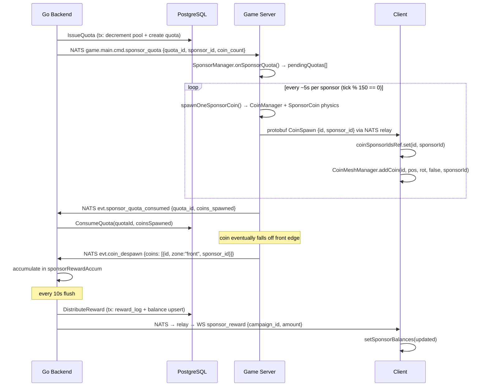
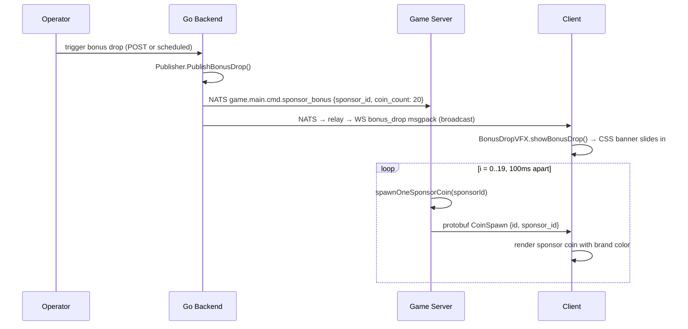

# Permissionless Sponsor Ads — Technical Guide

**Version:** v1 (2026-03-29)
**Audience:** Senior developer onboarding to the coin pusher project
**Status:** Active (implemented)

---

## Table of Contents

1. [Overview](#overview)
2. [Architecture](#architecture)
3. [Database Schema](#database-schema)
4. [API Endpoints](#api-endpoints)
5. [Data Flow: Sponsor Coin Lifecycle](#data-flow-sponsor-coin-lifecycle)
6. [Data Flow: Bonus Drop Event](#data-flow-bonus-drop-event)
7. [Data Flow: Ad Placements](#data-flow-ad-placements)
8. [Protocol Reference](#protocol-reference)
9. [Key Design Decisions](#key-design-decisions)
10. [Security Considerations](#security-considerations)
11. [Performance Considerations](#performance-considerations)
12. [Known Limitations and Future Work](#known-limitations-and-future-work)

---

## Overview

The Permissionless Sponsor Ads feature adds a sponsorship layer to the coin pusher game where any token with liquidity on a supported chain can purchase in-game exposure. Unlike external ad platforms — which reject Web3 and gambling-adjacent content — this system embeds sponsors directly into the game economy.

**What sponsors get:**
- Their branded coins appear on the pusher platform alongside regular coins
- Periodic "Bonus Drop" events rain their coins from above
- 3D ad placements on the back wall, side walls, and platform surface

**What players get:**
- Sponsor tokens credited to their balance when sponsor coins fall off the front edge
- Distribution uses the existing heat-based share system (same proportional logic as PLAY coin rewards)

**The three actors:**

| Actor | Role |
|---|---|
| **Sponsor** | Deposits tokens into a reward pool via API, uploads brand creatives |
| **Player** | Pushes coins, accumulates sponsor token balances via heat shares |
| **System** | Backend controls pool decrement and quota issuance; game server controls physics and coin spawning; client renders everything |

The system is deliberately **backend-driven**: the Go backend owns all economic state (pool balances, quotas, reward ledgers). The game server is an execution engine — it only spawns coins that the backend has authorized via quota messages.

---

## Architecture

```
┌─────────────────────────────────────────────────────────────────────┐
│                         Browser / Client                             │
│                                                                      │
│  ┌──────────────────────────────────────────────────────────────┐   │
│  │  App.tsx                                                      │   │
│  │  - sponsor coin ID tracking (sponsorCoinIdsRef)               │   │
│  │  - sponsor balance state (sponsorBalances)                    │   │
│  │  - bonus drop VFX trigger                                     │   │
│  └──────┬───────────────────────────────┬───────────────────────┘   │
│         │ onSponsorConfig               │ onBonusDrop / onReward     │
│  ┌──────▼───────────────┐     ┌─────────▼─────────────────────┐    │
│  │  SceneManager        │     │  BonusDropVFX                  │    │
│  │  updateSponsorConfig │     │  CSS banner (textContent)      │    │
│  │  addCoinWithSponsor  │     └───────────────────────────────┘    │
│  └──────┬───────────────┘                                           │
│  ┌──────▼────────────────────┐  ┌───────────────────────────────┐  │
│  │  CoinMeshManager          │  │  SponsorAdPlacements          │  │
│  │  per-sponsor thin instances│  │  back wall / side / platform  │  │
│  │  DynamicTexture logo      │  │  DynamicTexture ad images     │  │
│  └───────────────────────────┘  └───────────────────────────────┘  │
│  ┌──────────────────────────────────────────────────────────────┐   │
│  │  SponsorBalances.tsx  (display-only, v1)                      │   │
│  └──────────────────────────────────────────────────────────────┘   │
│                          WebSocket (binary: protobuf + msgpack)      │
└──────────────────────────────┬──────────────────────────────────────┘
                               │
┌──────────────────────────────▼──────────────────────────────────────┐
│                         Go Backend (API + WS relay)                  │
│                                                                      │
│  ┌────────────────────┐   ┌────────────────────────────────────┐   │
│  │  HTTP /v1/sponsor  │   │  ws.Handler                        │   │
│  │  (sponsorgrp)      │   │  - sends sponsor_config on connect  │   │
│  │  POST /campaign    │   │  (msgpack, from DB query)           │   │
│  │  GET /campaigns    │   └──────────────────┬─────────────────┘   │
│  │  POST /:id/upload  │                      │                      │
│  │  GET /balances     │   ┌──────────────────▼─────────────────┐   │
│  └────────────────────┘   │  ws.Relay (NATS subscriptions)     │   │
│                            │  - sponsor_config → msgpack → WS   │   │
│  ┌────────────────────┐   │  - sponsor_bonus  → msgpack → WS   │   │
│  │  sponsor.Core      │   │  - sponsor_reward → user WS        │   │
│  │  (business logic)  │   └──────────────────┬─────────────────┘   │
│  └────────────────────┘                      │ NATS                 │
│                                              │                      │
│  ┌──────────────────────────────────────┐   │                      │
│  │  main.go goroutines                  │   │                      │
│  │  - coin_despawn subscriber           │   │                      │
│  │  - sponsor reward accumulator        │   │                      │
│  │  - 10s flush → DistributeReward()    │   │                      │
│  │  - sponsor_reward NATS publish       │   │                      │
│  └──────────────────────────────────────┘   │                      │
└──────────────────────────────────────────────┼──────────────────────┘
                                               │ NATS
┌──────────────────────────────────────────────▼──────────────────────┐
│                     Game Server (TypeScript / Rapier)                │
│                                                                      │
│  ┌────────────────────────────────────────────────────────────┐    │
│  │  SponsorManager                                             │    │
│  │  - activeSponsors: Map<id, SponsorConfig>                  │    │
│  │  - coinSponsorMap: Map<coinId, campaignId>                  │    │
│  │  - pendingQuotas: PendingQuota[]                            │    │
│  │  - tick(): drain quotas 1 coin per ~5s per sponsor          │    │
│  │  - onBonusDrop(): staggered spawn 1/100ms                   │    │
│  └───────────────────────────┬────────────────────────────────┘    │
│                               │                                      │
│  ┌────────────────────────────▼──────────────────────────────────┐  │
│  │  GameLoop.tick()                                               │  │
│  │  - calls sponsorManager.tick(tickCount)                       │  │
│  │  - on despawn: sponsorManager.onCoinDespawn(id) → sponsor_id  │  │
│  │  - publishes coin_despawn JSON with sponsor_id field          │  │
│  └────────────────────────────────────────────────────────────────┘  │
│                                                                      │
│  ┌─────────────────────────────────────────────────────────────┐   │
│  │  NATSClient subscriptions                                     │   │
│  │  sponsor_config  → SponsorManager.onSponsorConfig()          │   │
│  │  cmd.sponsor_quota → SponsorManager.onSponsorQuota()         │   │
│  │  cmd.sponsor_bonus → SponsorManager.onBonusDrop()            │   │
│  └─────────────────────────────────────────────────────────────┘   │
└──────────────────────────────────────────────────────────────────────┘
```

### Service Boundaries Summary

| Concern | Owner |
|---|---|
| Pool state, quota issuance, reward distribution | Go backend |
| Coin physics, spawn execution, despawn classification | Game server |
| Rendering, ad display, balance UI | Client |
| Config propagation to active clients | NATS relay (Go backend) |

---

## Database Schema

Four tables support the sponsor feature. All reside in the same PostgreSQL database as the rest of the backend.

### `sponsor_campaigns`

The primary record for each sponsorship. One row = one active sponsorship.

```sql
CREATE TABLE sponsor_campaigns (
    campaign_id    UUID PRIMARY KEY DEFAULT gen_random_uuid(),
    created_by     UUID NOT NULL REFERENCES accounts(account_id),
    chain          TEXT NOT NULL,
    token_address  TEXT NOT NULL,
    token_symbol   TEXT NOT NULL CHECK (token_symbol ~ '^[A-Z0-9]{1,10}$'),
    token_decimals INT NOT NULL CHECK (token_decimals BETWEEN 0 AND 18),
    brand_color    TEXT NOT NULL CHECK (brand_color ~ '^#[0-9A-Fa-f]{6}$'),
    brand_name     TEXT NOT NULL CHECK (length(brand_name) BETWEEN 1 AND 32),
    logo_url       TEXT NOT NULL,
    ad_image_url   TEXT NOT NULL,
    pool_total     NUMERIC(38,18) NOT NULL CHECK (pool_total > 0),
    pool_remaining NUMERIC(38,18) NOT NULL CHECK (pool_remaining >= 0),
    reward_per_coin NUMERIC(38,18) NOT NULL CHECK (reward_per_coin > 0),
    status         TEXT NOT NULL DEFAULT 'active'
                   CHECK (status IN ('active', 'depleted', 'paused', 'expired')),
    created_at     TIMESTAMPTZ NOT NULL DEFAULT now(),
    updated_at     TIMESTAMPTZ NOT NULL DEFAULT now(),
    CONSTRAINT min_campaign_coins CHECK (pool_total / reward_per_coin >= 100)
);

CREATE INDEX idx_sponsor_campaigns_status ON sponsor_campaigns(status);
CREATE UNIQUE INDEX idx_sponsor_campaigns_token
    ON sponsor_campaigns(chain, token_address) WHERE status = 'active';
```

**Key constraints:**
- `min_campaign_coins`: enforces at least 100 coins worth of pool, preventing trivial campaigns
- Unique partial index on `(chain, token_address)` for active status: only one active campaign per token per chain
- `pool_remaining` auto-transitions to `depleted` status via the `DecrementPool` query (a CASE expression in the UPDATE)

**`pool_remaining` decrement query** (`backend/business/core/sponsor/stores/sponsordb/sponsordb.go`):
```sql
UPDATE sponsor_campaigns
SET pool_remaining = pool_remaining - $1,
    updated_at = now(),
    status = CASE WHEN pool_remaining - $1 <= 0 THEN 'depleted' ELSE status END
WHERE campaign_id = $2
  AND pool_remaining - $1 >= 0
RETURNING pool_remaining
```
The `AND pool_remaining - $1 >= 0` predicate makes the decrement atomic — it returns zero rows (causing an error) if the pool would go negative.

### `sponsor_quota_ledger`

Tracks every batch of coins authorized for spawning. This is the reconciliation table: if the game server crashes after the backend decremented the pool but before it published ACK, the reconciliation goroutine reads `issued` quotas older than 5 minutes and refunds them.

```sql
CREATE TABLE sponsor_quota_ledger (
    quota_id       UUID PRIMARY KEY DEFAULT gen_random_uuid(),
    campaign_id    UUID NOT NULL REFERENCES sponsor_campaigns(campaign_id),
    coin_count     INT NOT NULL CHECK (coin_count > 0),
    coins_spawned  INT NOT NULL DEFAULT 0,
    token_amount   NUMERIC(38,18) NOT NULL,
    status         TEXT NOT NULL DEFAULT 'issued'
                   CHECK (status IN ('issued', 'consumed', 'refunded')),
    issued_at      TIMESTAMPTZ NOT NULL DEFAULT now(),
    consumed_at    TIMESTAMPTZ
);

CREATE INDEX idx_sponsor_quota_ledger_status ON sponsor_quota_ledger(status, issued_at);
```

**Status lifecycle:** `issued` → `consumed` (normal path) or `issued` → `refunded` (reconciliation path on game server restart/crash)

### `sponsor_balances`

Per-player, per-campaign balance. Upserted on each reward distribution.

```sql
CREATE TABLE sponsor_balances (
    account_id    UUID NOT NULL REFERENCES accounts(account_id),
    campaign_id   UUID NOT NULL REFERENCES sponsor_campaigns(campaign_id),
    balance       NUMERIC(38,18) NOT NULL DEFAULT 0 CHECK (balance >= 0),
    updated_at    TIMESTAMPTZ NOT NULL DEFAULT now(),
    PRIMARY KEY (account_id, campaign_id)
);
```

**v1 note:** These balances are display-only. On-chain withdrawal is deferred to v2. The `GET /v1/sponsor/balances` endpoint returns this table directly.

### `sponsor_reward_logs`

Immutable audit trail for every reward distribution event.

```sql
CREATE TABLE sponsor_reward_logs (
    log_id        UUID PRIMARY KEY DEFAULT gen_random_uuid(),
    account_id    UUID NOT NULL REFERENCES accounts(account_id),
    campaign_id   UUID NOT NULL REFERENCES sponsor_campaigns(campaign_id),
    amount        NUMERIC(38,18) NOT NULL CHECK (amount > 0),
    ref_key       TEXT NOT NULL UNIQUE,
    created_at    TIMESTAMPTZ NOT NULL DEFAULT now()
);

CREATE INDEX idx_sponsor_reward_logs_account
    ON sponsor_reward_logs(account_id, campaign_id, created_at DESC);
```

The `ref_key` column has a `UNIQUE` constraint and is populated deterministically:

```
sponsor:{campaign_id}:{account_id}:{flush_epoch}
```

where `flush_epoch = unix_timestamp / 10` (10-second buckets). This means a retry of the same flush interval for the same player-campaign pair will hit the unique constraint and fail gracefully rather than double-crediting. This is the primary idempotency mechanism.

### Schema Relationships

```
accounts ──< sponsor_campaigns (created_by)
          └< sponsor_balances
          └< sponsor_reward_logs

sponsor_campaigns ──< sponsor_quota_ledger
                  └< sponsor_balances
                  └< sponsor_reward_logs
```

---

## API Endpoints

All routes are registered at `backend/app/services/api/main.go` under the chi router's `/v1/sponsor` prefix. The handler implementation is in `backend/app/services/api/handlers/v1/sponsorgrp/sponsorgrp.go`.

### `POST /v1/sponsor/campaign`

Creates a new sponsor campaign. Requires JWT authentication.

**Request body:**
```json
{
  "chain": "sui",
  "token_address": "0xabc...def",
  "token_symbol": "MYTOKEN",
  "token_decimals": 9,
  "brand_color": "#FF6B35",
  "brand_name": "MyProject",
  "logo_url": "/uploads/sponsors/{id}/logo.jpg",
  "ad_image_url": "/uploads/sponsors/{id}/ad.jpg",
  "pool_total": "10000.000000000000000000",
  "reward_per_coin": "1.000000000000000000"
}
```

**Constraints validated by handler:**
- `chain`, `token_address`, `token_symbol`, `brand_name`: required, non-empty
- `pool_total`, `reward_per_coin`: must parse as positive decimal strings
- DB CHECK constraints on `token_symbol`, `brand_color`, `brand_name`, `min_campaign_coins` enforce further bounds

**Response:** `201 Created` with the full `Campaign` struct as JSON, including the generated `campaign_id`.

**Note:** In practice, the workflow is: create campaign first (with placeholder URLs), then upload images, then update the campaign with real URLs. The API does not enforce that images are uploaded before activation.

### `GET /v1/sponsor/campaigns`

Returns all campaigns with `status = 'active'`, ordered by `created_at DESC`. No authentication required (public list).

**Response:** `200 OK` with `[]Campaign`.

### `GET /v1/sponsor/campaign/{id}`

Returns a single campaign by UUID. No authentication required.

**Response:** `200 OK` with `Campaign` or `404` if not found.

### `POST /v1/sponsor/campaign/{id}/upload`

Multipart form upload for campaign images. Requires JWT authentication.

**Form fields:**
- `logo` (optional): coin face image (PNG or JPEG, max 512KB)
- `ad_image` (optional): wall/surface ad image (PNG or JPEG, max 512KB)

At least one field must be present.

**Validation pipeline:**
1. Body capped at 512KB via `http.MaxBytesReader` before any parsing
2. Magic byte detection via `http.DetectContentType` — only `image/jpeg` and `image/png` accepted
3. Full image decode (`jpeg.Decode` / `png.Decode`) to verify the bytes are a valid image
4. Server-generated UUID filename — user-supplied filename is ignored entirely
5. Stored at `./uploads/sponsors/{campaign_id}/{uuid}.{ext}`

**Response:**
```json
{
  "logo_url": "/uploads/sponsors/{id}/{uuid}.jpg",
  "ad_image_url": "/uploads/sponsors/{id}/{uuid}.png"
}
```

**Static file serving:** Uploaded images are served by a dedicated `http.FileServer` registered at `/uploads/sponsors/*` with security headers (`X-Content-Type-Options: nosniff`, `Content-Disposition: inline`).

### `GET /v1/sponsor/balances`

Returns the authenticated user's sponsor token balances across all campaigns. Requires JWT authentication.

**Response:**
```json
[
  {
    "account_id": "...",
    "campaign_id": "...",
    "balance": "42.500000000000000000",
    "updated_at": "2026-03-29T10:00:00Z"
  }
]
```

---

## Data Flow: Sponsor Coin Lifecycle

This section traces a sponsor coin from the moment pool tokens are committed through to player balance credit.

### Phase 1: Pool Decrement and Quota Issuance

The Go backend (a goroutine or external trigger not shown in the current code — quota issuance is driven by `IssueQuota` calls) atomically decrements the campaign pool and records a quota entry in a single transaction:

```
sponsor.Core.IssueQuota(ctx, campaignID, coinCount=5)
  │
  ├── s.QueryByID() → load campaign (get reward_per_coin)
  ├── tokenAmount = reward_per_coin × coinCount
  ├── s.DecrementPool(ctx, campaignID, tokenAmount)  ← atomic UPDATE with guard
  └── s.CreateQuota(ctx, QuotaEntry{status="issued"}) ← ledger record
```

After a successful transaction, `Publisher.PublishQuota()` sends the quota to the game server:

**NATS topic:** `game.main.cmd.sponsor_quota`
```json
{
  "quota_id": "550e8400-e29b-41d4-a716-446655440000",
  "sponsor_id": "campaign-uuid",
  "coin_count": 5
}
```

### Phase 2: Game Server Quota Receipt and Coin Spawning

The game server's `NATSClient` receives the quota on `game.main.cmd.sponsor_quota` and calls `SponsorManager.onSponsorQuota()`, which appends to `pendingQuotas`:

```typescript
// game/server/src/game/SponsorManager.ts
onSponsorQuota(msg): void {
  this.pendingQuotas.push({
    quotaId: msg.quota_id,
    sponsorId: msg.sponsor_id,
    remaining: msg.coin_count,
    total: msg.coin_count,
  });
}
```

On every physics tick, `GameLoop.tick()` calls `sponsorManager.tick(tickCount)`. The tick drains quotas at a rate of one coin per `QUOTA_SPAWN_INTERVAL_TICKS` ticks (150 ticks = ~5 seconds at 30Hz):

```typescript
// game/server/src/game/SponsorManager.ts
tick(tickCount: number): void {
  if (tickCount % QUOTA_SPAWN_INTERVAL_TICKS !== 0) return;
  // round-robin across pendingQuotas
  const quota = this.pendingQuotas[this.sponsorRoundRobin];
  this.spawnOneSponsorCoin(quota.sponsorId);
  quota.remaining--;
  if (quota.remaining <= 0) {
    this.natsClient.publishSponsorQuotaConsumed({ quota_id, coins_spawned });
    // remove from pendingQuotas
  }
}
```

`spawnOneSponsorCoin()` picks a random X from the five slot positions, calls the spawn callback wired by `GameLoop`:

```typescript
// game/server/src/game/GameLoop.ts (constructor)
this.sponsorManager.setSpawnFn((x, y, sponsorId) => {
  const coinId = this.coinManager.spawnCoin(x, y, undefined, undefined, "sponsor_coin", sponsorId);
  if (coinId !== null) {
    const coin = new SponsorCoin(this.physicsWorld, coinId, x, y, 0);
    this.addCoin(coin);
  }
  return coinId;
});
```

The call chain for a single sponsor coin creation:

```
SponsorManager.spawnOneSponsorCoin(sponsorId)
  │
  ├── CoinManager.spawnCoin(x, y, z, rot, "sponsor_coin", sponsorId)
  │     └── GameState.addCoin(id, x, y, z, rot, "sponsor_coin", sponsorId)
  │           └── bodies.set(id, { type: "sponsor_coin", sponsor_id: sponsorId, ... })
  │
  ├── new SponsorCoin(physicsWorld, coinId, x, y, 0)
  │     └── RAPIER.RigidBodyDesc.dynamic() + roundCylinder collider
  │         (identical geometry to regular coin: 0.06m radius, 0.012m thickness)
  │
  ├── coinSponsorMap.set(coinId, sponsorId)       ← for despawn tracking
  │
  └── NATSClient.publishCoinSpawn({ coins: [{ id, owner_id: "", sponsor_id }] })
        └── protobuf CoinSpawn → NATS game.main.coin_spawn → relay → all WS clients
```

### Phase 3: sponsor_id Persistence in WorldSnapshot

The `sponsor_id` is stored in `GameState.bodies` as `BodyStateWithSponsor`. When the game server serializes a `WorldSnapshot` (on connect or periodic publish), it maps `body.sponsor_id` to the protobuf `BodyState.sponsor_id` field (field number 11):

```typescript
// game/server/src/nats/NATSClient.ts
bodies: snapshot.bodies.map((b) => ({
  ...
  sponsorId: b.sponsor_id ?? "",
}))
```

This means: if a client reconnects after the server has been running for an hour, the snapshot contains all currently live sponsor coins with their campaign IDs. The client reconstructs its `sponsorCoinIdsRef` from the snapshot.

### Phase 4: Physics and Despawn Classification

`SponsorCoin` is identical to `Coin` in physics properties (mass, friction, restitution, CCD behavior). The only difference is the class name and constructor source (`game/server/src/physics/SponsorCoin.ts`).

When the coin's Y position drops below `COIN_CONFIG.DESPAWN_Y` (-0.1m), it is marked for despawn by `shouldDespawn()`. In `GameLoop.tick()`, despawned coins are collected and classified by zone:

```typescript
// game/server/src/game/GameLoop.ts (despawn phase, simplified)
for (const id of despawnIds) {
  const sponsorId = this.sponsorManager.onCoinDespawn(id);
  coins.push({ id, zone: classifyZone(pos), owner_id: ownerOrSystem, sponsor_id: sponsorId ?? "" });
}
this.natsClient.publishCoinDespawn({ coins, tick });
```

The despawn event is published as JSON to `game.main.evt.coin_despawn`. The protobuf `Despawn` message (sent to clients for rendering removal) remains as a plain list of IDs — `sponsor_id` is not in the protobuf despawn path.

**Zone classification:**
- `"front"` — coin fell off the front edge (triggers token reward)
- `"left_wall"` — through the left-wall opening (triggers slot machine counter, no sponsor reward)
- `"right_wall"` — through the right-wall opening (triggers jackpot wheel counter, no sponsor reward)
- `"other"` — fell below platform via other path

### Phase 5: Reward Accumulation (Go Backend)

The Go backend subscribes to `game.main.evt.coin_despawn` in `main.go`. For each `"front"` zone coin with a non-empty `sponsor_id`:

```go
// backend/app/services/api/main.go (despawn subscriber)
for campaignIDStr, count := range sponsorFrontCounts {
    camp, _ := sponsorCore.Get(ctx, campaignID)
    totalReward := camp.RewardPerCoin.Mul(decimal.NewFromInt(int64(count)))
    shares := heatEngine.GetShares()  // current heat distribution

    for _, ps := range shares {
        playerAmount := totalReward.Mul(decimal.NewFromFloat(ps.Share))
        key := sponsorRewardKey{CampaignID: campaignID, AccountID: ps.UserID}
        sponsorRewardAccum[key] = sponsorRewardAccum[key].Add(playerAmount)
    }
}
```

Amounts are accumulated in-memory (`sponsorRewardAccum`) and flushed every 10 seconds.

### Phase 6: Reward Flush and Balance Credit

The 10-second flush goroutine processes `sponsorRewardAccum`:

```go
// backend/app/services/api/main.go (sponsor reward flush)
flushEpoch := time.Now().Unix() / 10
for key, amount := range batch {
    refKey := fmt.Sprintf("sponsor:%s:%s:%d", key.CampaignID, key.AccountID, flushEpoch)
    sponsorCore.DistributeReward(ctx, key.CampaignID, key.AccountID, amount, refKey)
}
```

`DistributeReward` runs in a transaction:
1. `CreateRewardLog` — inserts into `sponsor_reward_logs` with the deterministic `ref_key` (unique constraint provides idempotency)
2. `CreditBalance` — upserts `sponsor_balances` with `ON CONFLICT DO UPDATE SET balance = balance + EXCLUDED.balance`

After the DB write, a `sponsor_reward` JSON message is published to NATS (`game.main.sponsor_reward`). The relay picks it up and re-encodes as msgpack, sending to the specific user via `hub.SendToUser()`.

### Complete Sequence Diagram



---

## Data Flow: Bonus Drop Event

Bonus drops are event-driven (not quota-driven) and bypass the quota ledger entirely. They are triggered externally (operator or automated scheduler) via the HTTP/NATS path.

### Trigger

`Publisher.PublishBonusDrop()` publishes to `game.main.cmd.sponsor_bonus`:
```json
{
  "sponsor_id": "campaign-uuid",
  "sponsor_name": "MyProject",
  "token_symbol": "MYTOKEN",
  "coin_count": 20
}
```

This message travels two paths in parallel:

**Path 1 — Announcement to clients:**
The relay subscribes to `game.main.cmd.sponsor_bonus`, re-encodes as msgpack, and broadcasts to all WebSocket clients. The client's `App.tsx` handles `bonus_drop` messages:

```typescript
// game/client/src/App.tsx
case "bonus_drop":
  bonusVFX.showBonusDrop(msg.sponsor_name, msg.token_symbol, "#4ECDC4", msg.coin_count);
```

`BonusDropVFX` creates a full-width CSS banner that slides in from the top. Note that `brandColor` is hardcoded to `"#4ECDC4"` in the current client code rather than using `msg.brand_color` — a known simplification.

**Path 2 — Staggered spawn in game server:**
The game server's `subscribeBonusDrop` handler calls `SponsorManager.onBonusDrop()`:

```typescript
// game/server/src/game/SponsorManager.ts
onBonusDrop(msg): void {
  for (let i = 0; i < msg.coin_count; i++) {
    const timer = setTimeout(() => {
      this.spawnOneSponsorCoin(msg.sponsor_id);
    }, i * 100);  // 1 coin per 100ms
    this.bonusDropTimers.push(timer);
  }
}
```

The 100ms stagger is deliberate: spawning 20 coins in one tick would spike physics cost and cause a visible frame drop. Staggered spawning distributes the load across 2 seconds.

Each spawned coin follows the same path as regular sponsor coins (physics body, `coinSponsorMap` registration, `CoinSpawn` protobuf to clients).

**Cap behavior:** Bonus drops respect `MAX_ACTIVE_COINS` (800) implicitly because `spawnOneSponsorCoin` calls `CoinManager.spawnCoin`, which does not bypass the physics world limit that `GameLoop.tick()` enforces for regular coin drops. However, the bonus drop itself does not pre-check capacity — it will attempt to spawn coins regardless, and the spawn will silently fail if the platform is at capacity.

### Bonus Drop Sequence



---

## Data Flow: Ad Placements

Ad placements use a different propagation path than coins. They are texture planes rendered in the BabylonJS scene, updated dynamically when sponsor configuration changes.

### Config Propagation

**On WebSocket connect** (`backend/business/web/ws/handler.go`):

When a client connects, the WS handler immediately queries `sponsorCore.ListActive()` and sends the result as a msgpack `sponsor_config` message directly to the new connection — before the read pump starts. This ensures the client always has the current sponsor list without waiting for the next NATS broadcast.

**On config change** (`backend/business/core/sponsor/publisher.go`):

When a campaign is created or status changes, `Publisher.PublishConfig()` queries active campaigns and publishes JSON to `game.main.sponsor_config`. The relay (`backend/business/web/ws/relay.go`) subscribes to this topic, re-encodes as msgpack, and broadcasts to all connected clients.

### Client-Side 3D Plane Rendering

The client processes `sponsor_config` messages in two places:

**1. CoinMeshManager — coin prototypes** (`game/client/src/scene/CoinMeshManager.ts`):

```typescript
// game/client/src/scene/SceneManager.ts
updateSponsorConfig(sponsors): void {
  for (const sponsor of sponsors) {
    this.coinManager.createSponsorCoinPrototype(sponsor.id, sponsor.brand_color, sponsor.logo_url);
  }
  this.sponsorAdPlacements.updateSponsorCreatives(sponsors);
}
```

`createSponsorCoinPrototype` creates a BabylonJS cylinder mesh (matching `SPONSOR_COIN_CONFIG` dimensions) and sets up a thin-instance buffer (capacity 100 coins per sponsor). On desktop, it loads the logo via `new Image()`, draws it into a 256×256 `DynamicTexture`, then applies a toon material. On mobile (aspect ratio < 1.0), it skips the `DynamicTexture` and uses a flat brand-color toon material only.

**2. SponsorAdPlacements — wall and surface planes** (`game/client/src/scene/SponsorAdPlacements.ts`):

Three placement tiers:

| Tier | Mesh | Dimensions | Position |
|---|---|---|---|
| `primary` | Back wall plane | 1.0m × 0.5m | y=1.4, z=0.03 above back wall |
| `secondary` | Left + right side wall planes | 0.4m × 0.4m | y=0.3, z=-0.1 on inner wall face |
| `tertiary` | Platform surface plane | 0.8m × 0.4m | y=0.251, rotated flat |

Each tier maps `sponsor.ad_image_url` to a `DynamicTexture` created after the image loads:

```typescript
// game/client/src/scene/SponsorAdPlacements.ts
img.onload = () => {
  const dt = new DynamicTexture(matName + "Tex", 256, this.scene, false);
  ctx.drawImage(img, 0, 0, 256, 256);
  dt.update(false);
  dt.hasAlpha = true;   // must be set AFTER update()
  // create toon material with diffuseTexture: dt
};
```

The `dt.hasAlpha = true` after `dt.update()` is a known BabylonJS pitfall documented in the project MEMORY.md.

**Platform plane mobile skip:** `createPlatformAd` checks `engine.getRenderWidth() / engine.getRenderHeight() < 1.0` and skips creation on portrait mobile. The platform ad is nearly invisible from the mobile camera distance (~6.5m) and the skip saves a draw call.

### Disposal Pattern

`SponsorAdPlacements` tracks all active materials and textures in `activeMaterials[]`. On `updateSponsorCreatives`, old textures are disposed before new ones are created:

```typescript
for (const entry of this.activeMaterials) {
  if (entry.texture) {
    entry.material.setTexture("diffuseTex", null);  // unlink first
    entry.texture.dispose();
  }
}
```

Setting `particleTexture = null` before `dispose()` prevents double-dispose if textures are shared — this follows the BabylonJS shared-texture disposal rule in MEMORY.md.

---

## Protocol Reference

### Protobuf Messages

Sponsor-related fields extend existing protobuf messages in `game/shared/proto/game.proto`.

**`CoinSpawnEntry`** — sent when any coin is spawned:
```protobuf
message CoinSpawnEntry {
  uint32 id       = 1;
  string owner_id = 2;
  bool is_key_coin = 3;
  string sponsor_id = 6;  // empty = regular coin; non-empty = campaign UUID
}
```

**`BodyState`** — used in `WorldSnapshot` for reconnect/restart recovery:
```protobuf
message BodyState {
  uint32 id   = 1;
  string type = 2;   // "coin" | "key_coin" | "sponsor_coin" | "pusher"
  float pos_x = 3;
  float pos_y = 4;
  float pos_z = 5;
  float rot_x = 6;
  float rot_y = 7;
  float rot_z = 8;
  float rot_w = 9;
  float z      = 10;
  string sponsor_id = 11;  // persisted for sponsor_coin type
}
```

**`Despawn`** — unchanged from base protocol:
```protobuf
message Despawn {
  uint32 tick = 1;
  repeated uint32 ids = 2;
}
```

The client already knows which coins are sponsor coins from the `CoinSpawn` message — the despawn message carries only IDs.

### Msgpack Messages (Server → Client)

These messages are delivered over WebSocket as msgpack-encoded maps. The first byte distinguishes msgpack from protobuf (msgpack fixmap: `0x80`–`0x8f`).

**`sponsor_config`** — sent on connect and on config change:
```typescript
type SponsorConfigMessage = {
  op: "sponsor_config";
  sponsors: Array<{
    id: string;              // campaign UUID
    brand_name: string;
    token_symbol: string;
    brand_color: string;     // "#RRGGBB"
    logo_url: string;        // HTTP path, e.g. /uploads/sponsors/{id}/{uuid}.jpg
    ad_image_url: string;    // HTTP path
    placement_tier?: "primary" | "secondary" | "tertiary";
  }>;
};
```

**`bonus_drop`** — broadcast to all clients when a bonus drop is triggered:
```typescript
type BonusDropMessage = {
  op: "bonus_drop";
  sponsor_id: string;
  sponsor_name: string;
  token_symbol: string;
  coin_count: number;
};
```

**`sponsor_reward`** — targeted to the earning player:
```typescript
type SponsorRewardMessage = {
  op: "sponsor_reward";
  campaign_id: string;
  token_symbol: string;
  amount: string;        // decimal string, e.g. "2.500000000000000000"
  total_balance: string; // v1: same as amount (cumulative not tracked per-notify)
};
```

### JSON (NATS Internal Messages)

These messages flow over NATS between backend services and the game server. They are never sent to clients directly.

| Topic | Direction | Payload |
|---|---|---|
| `game.main.sponsor_config` | Backend → Game Server + Relay | `{ op, sponsors[] }` |
| `game.main.cmd.sponsor_quota` | Backend → Game Server | `{ quota_id, sponsor_id, coin_count }` |
| `game.main.evt.sponsor_quota_consumed` | Game Server → Backend | `{ quota_id, coins_spawned }` |
| `game.main.cmd.sponsor_bonus` | Backend → Game Server + Relay | `{ sponsor_id, sponsor_name, token_symbol, coin_count }` |
| `game.main.evt.coin_despawn` | Game Server → Backend | `{ coins: [{id, zone, owner_id, sponsor_id}], tick }` |
| `game.main.sponsor_reward` | Backend → Relay | `{ op, user_id, campaign_id, token_symbol, amount }` |

**Go struct definitions** are in `backend/business/web/ws/nats_messages.go`:
- `NATSSponsorQuota`
- `NATSSponsorQuotaConsumed`
- `NATSSponsorBonusDrop`

### NATS Topic Constants

All topic strings are generated by functions in `backend/business/web/ws/topics.go`:

```go
TopicSponsorConfig(room)        → "game.{room}.sponsor_config"
TopicSponsorQuota(room)         → "game.{room}.cmd.sponsor_quota"
TopicSponsorQuotaConsumed(room) → "game.{room}.evt.sponsor_quota_consumed"
TopicSponsorBonusDrop(room)     → "game.{room}.cmd.sponsor_bonus"
```

The `coin_despawn` event uses the existing `TopicCoinDespawn` topic, extended with the optional `sponsor_id` field.

---

## Key Design Decisions

### Pool Decrement at Quota Issuance, Not at Despawn

Pool tokens are committed when a quota is issued (before any coin is spawned), not when coins fall off the edge. This is the correct direction: the sponsor's pool is depleted as coins enter the game world, not as they are rewarded to players.

The risk of this approach is that a game server crash after pool decrement but before coin spawning would silently lose those tokens. The quota ledger and reconciliation goroutine address this:

1. `IssueQuota` records a `status="issued"` entry before any NATS publish
2. `ConsumeQuota` marks it `"consumed"` when the game server ACKs
3. `ReconcileStaleQuotas` (runs on startup and periodically) finds `issued` quotas older than 5 minutes and calls `RefundQuota`, which restores the pool via `DecrementPool` with a negated amount

The batch size is kept small (5 coins per quota) to minimize the liability window — at most 5 × `reward_per_coin` tokens are at risk at any time.

**Reference:** `backend/business/core/sponsor/sponsor.go:IssueQuota`, `ReconcileStaleQuotas`

### Backend-Driven Quota, Game Server Executes

The game server has no authority over whether sponsor coins should appear. It only acts on backend authorization. This means:
- The backend can pause a campaign (stop issuing quotas) and no new sponsor coins will appear
- The game server cannot overspend a sponsor's pool — it spawns exactly the coins in its pending quota
- Rate of injection is controlled by `QUOTA_SPAWN_INTERVAL_TICKS` (one coin per ~5 seconds per sponsor in round-robin)

### NATS JetStream Intention vs. Current Implementation

The plan specifies using JetStream with durable consumers and explicit ACK for quota and config messages. The foundation helper `ConnectWithJetStream` is implemented in `backend/foundation/nats/jetstream.go`. However, the current quota publish in `publisher.go` uses core NATS (`nc.Publish`), not JetStream. The JetStream migration is the correct next step for production hardening.

The coin_despawn and state_delta topics intentionally stay on core NATS (at-most-once) — losing a physics update is acceptable. Losing a quota publish is not.

### WorldSnapshot Persistence of sponsor_id

`sponsor_id` is stored in `GameState.bodies` (field `body.sponsor_id`) and serialized into the protobuf `BodyState.sponsor_id` (field 11). This means:

- On game server restart: sponsor coins that were live before the restart survive in the snapshot cache and reconnecting clients can render them correctly
- On new client connect: the `WorldSnapshot` includes all currently live sponsor coin mappings

Without this, a client reconnecting mid-game would see sponsor coins rendered as regular coins (wrong color/logo), and more critically, the `coinSponsorMap` in `SponsorManager` would not be populated after restart — those coins would be treated as regular coins at despawn time, breaking reward routing.

### Sponsor Coin Body Type: `"sponsor_coin"`

Sponsor coins are a distinct value in the `BodyType` union (`game/shared/src/types.ts`). This is a deliberate choice over using `"coin"` with a non-empty `sponsor_id`:
- The body type is used by `WebSocketClient.convertProtoToServerMessage` to decide how to set `sponsor_id` from the snapshot
- `CoinMeshManager.addCoin` checks `sponsorId` to route coins to the correct thin-instance buffer
- The explicit type makes the intent clear and prevents accidental misrouting

### Reward Distribution via Heat Shares

Sponsor token rewards use the same heat-based distribution as regular PLAY coin rewards. When a sponsor coin falls off the front edge:

```
total_reward = reward_per_coin × coin_count
for each player in heat_shares:
    player_amount = total_reward × player.share_fraction
```

This means players with more heat (more recently active, more coins deposited) earn proportionally more sponsor tokens. Crucially, sponsor coins have `owner_id = "system"` (empty string) — they are not attributed to any specific player for heat purposes. The heat shares from all active players are applied to the total reward pool for that coin batch.

### No Protobuf BonusDrop Message

Bonus drops are low-frequency (every 3-7 minutes at most) and do not require the bandwidth optimization of protobuf. The announcement goes as msgpack `bonus_drop` directly. The actual coins spawned by the bonus drop arrive via the existing protobuf `CoinSpawn` stream.

### Sponsor Creative Locked at Deposit Time

Brand color, logo, and ad images cannot change while a campaign is active. To update creatives, a sponsor creates a new campaign. This avoids runtime texture regeneration on all connected clients (which would require re-creating `DynamicTexture` instances across potentially hundreds of connections simultaneously).

---

## Security Considerations

### Image Upload Security

The upload handler (`sponsorgrp.Upload`) implements a defense-in-depth approach:

1. **Body size cap before parsing:** `http.MaxBytesReader(w, r.Body, 512KB)` is applied before `ParseMultipartForm`. This prevents memory exhaustion from large multipart requests.

2. **Magic byte validation:** `http.DetectContentType(data)` checks the first 512 bytes for recognized image signatures. Extension and `Content-Type` headers from the client are ignored entirely.

3. **Full image decode:** `jpeg.Decode` / `png.Decode` is called on the data. This verifies that the file is a valid, parseable image — not a polyglot file (e.g., a ZIP that starts with valid JPEG bytes). This defense is present in the current implementation; govips re-encoding (which would additionally strip metadata) is mentioned in the plan as the production target but is not yet wired.

4. **Server-generated filenames:** `uuid.NewString() + "." + ext` — the user-supplied filename is discarded. This prevents path traversal attacks.

5. **`campaign_id` UUID validation:** The `{id}` URL parameter is parsed with `uuid.Parse` before being used in the file path. Malformed IDs are rejected with 400, preventing path components like `../../etc/passwd`.

6. **Static file security headers:** The static file server for `/uploads/sponsors/*` adds `X-Content-Type-Options: nosniff` and `Content-Disposition: inline`.

### XSS Prevention in Bonus Drop Banner

`BonusDropVFX.showBonusDrop` uses `banner.textContent = ...` exclusively. No `innerHTML` is used anywhere. Sponsor names are displayed verbatim as text — HTML tags in a `brand_name` like `<script>alert(1)</script>` will render as literal text.

### Input Constraints via DB CHECK

All user-supplied string fields have DB-level CHECK constraints that double as input sanitization:
- `token_symbol ~ '^[A-Z0-9]{1,10}$'` — prevents injection via token display
- `brand_color ~ '^#[0-9A-Fa-f]{6}$'` — hex only, prevents CSS injection if color is used in CSS properties
- `brand_name` length between 1 and 32 — prevents oversized display strings

The `brand_color` field is used directly in `BonusDropVFX`:
```typescript
banner.style.cssText = [ ..., `background: ${brandColor}`, ... ].join("; ");
```
The hex-only regex enforced at the DB level prevents CSS injection via the `background` property.

### Authentication and Authorization

All mutating sponsor endpoints (`POST /campaign`, `POST /:id/upload`, `GET /balances`) require a valid JWT via `mid.Authenticate`. The `created_by` field on `sponsor_campaigns` is set from the JWT claims, enabling future authorization checks (e.g., only the creator can pause a campaign).

The `GET /campaigns` and `GET /campaign/{id}` endpoints are public (no auth required) — the active sponsor list is non-sensitive public information needed by unauthenticated spectators.

### Interval Randomization Against Timing Attacks

Bonus drop intervals are specified as randomized (3-7 minutes) in the plan. Fixed intervals would allow players to time heat accumulation to maximize their share of sponsor token rewards at minimal PLAY cost. The randomization makes exact timing unpredictable. (Note: the current implementation relies on the operator/scheduler to implement this randomization; the game server itself does not enforce it.)

---

## Performance Considerations

### Thin-Instance Draw Calls

Each active sponsor campaign adds one draw call for its coin mesh (using BabylonJS thin instances). With 3-5 simultaneous sponsors and 2 existing draw calls (regular coins, key coins), the total is 5-7 draw calls for the coin layer. BabylonJS forum research (cited in the implementation plan) confirms this is within the negligible overhead range for mobile — no texture atlas is needed.

**Per-sponsor thin-instance buffer:** Initial capacity is 100 coins per sponsor. `resizeSponsorBuffer` doubles capacity when full. The `swap-and-pop` removal pattern maintains contiguous arrays.

**Prototype mesh:** Each sponsor's `SponsorCoin` prototype mesh uses `prototype.thinInstanceEnablePicking = false` and `prototype.alwaysSelectAsActiveMesh = true`. These are required for thin-instance performance — without `alwaysSelectAsActiveMesh`, BabylonJS frustum-culls the prototype if it's outside the view, removing all instances.

### DynamicTexture Timing

`DynamicTexture` must be created after the image has loaded. Creating a `DynamicTexture` and then calling `drawImage` before the image is fully decoded produces a blank texture. The code uses the `img.onload` callback pattern throughout:

```typescript
img.onload = () => {
  const dt = new DynamicTexture(...);
  ctx.drawImage(img, 0, 0, 256, 256);
  dt.update(false);
  dt.hasAlpha = true;   // must be after update()
  // then create material
};
```

During the load period, a temporary flat brand-color material is used so the coin is visible immediately.

### Mobile Optimizations

- `createSponsorCoinPrototype`: skips `DynamicTexture` on mobile (aspect ratio < 1.0), uses flat brand-color material
- `createPlatformAd`: skips the platform surface ad plane entirely on mobile
- The back wall and side wall ads are created on all devices but are visually small at the mobile camera distance (~6.5m pull-back); this is accepted per the requirements ("primary sponsor exposure on mobile comes from sponsor coins and bonus drop events")

### Texture Pre-loading

Sponsor coin prototypes are created eagerly when `sponsor_config` is received, before any sponsor coins appear in the scene. This ensures the `DynamicTexture` and toon material are ready by the time the first `CoinSpawn` message arrives with a `sponsor_id`. If the prototype is not yet ready when a coin spawn arrives, `CoinMeshManager` routes the coin to the sponsor buffer only if `sponsorPrototypes.has(coin.sponsorId)` — coins whose sponsor has no prototype yet are skipped (dropped silently from the batch).

### Physics Cost

`SponsorCoin` has identical physics parameters to `Coin`. There is no additional physics cost per sponsor coin beyond the existing per-coin Rapier simulation cost. The quota drain rate of one coin per 5 seconds per sponsor keeps the incremental platform load low.

---

## Known Limitations and Future Work

### v1 Limitations

**Display-only sponsor balances.** `sponsor_balances` tracks earnings but there is no on-chain withdrawal. Players can see their accumulated sponsor tokens but cannot move them to a wallet. On-chain withdrawal requires smart contract work and is deferred to v2.

**No JetStream on quota publish path.** `Publisher.PublishQuota` uses core NATS (`nc.Publish`), which is at-most-once. If NATS is unavailable when a quota is published, the message is lost. The quota ledger's reconciliation mechanism partially mitigates this (the pool is already decremented and will be refunded if the quota is never consumed), but the game server will not receive the spawn authorization. The `ConnectWithJetStream` helper exists; the migration of `PublishQuota` to use a JetStream WorkQueue stream is the next hardening step.

**No content moderation.** There is no automated check for inappropriate brand names, colors, or uploaded images. Any authenticated account can create a campaign with any content that passes the format constraints. A human moderation queue or AI classifier is needed before allowing arbitrary public sponsors.

**No pricing or allocation mechanism.** Which sponsor gets which placement tier (primary/secondary/tertiary), how exposure is allocated among multiple active sponsors, and the formula relating deposit size to bonus drop frequency are all unimplemented. The `placement_tier` field exists in the config message but is not populated by the backend — the publisher does not currently assign tiers.

**Bonus drop does not validate pool remaining.** `onBonusDrop` spawns coins unconditionally without checking whether the campaign pool has sufficient balance to cover the bonus drop rewards. A bonus drop on a near-depleted pool could result in over-distribution.

**`brandColor` hardcoded in bonus drop VFX.** `BonusDropVFX` receives `brandColor` as a parameter but `App.tsx` passes `"#4ECDC4"` instead of `msg.brand_color`. The bonus drop banner will always show teal regardless of the sponsor's actual brand color.

**No sponsor analytics.** Impression counts, banner view duration, coin click-through rates — none are tracked. This was explicitly deferred from scope.

**`total_balance` in `sponsor_reward` message is not cumulative.** The relay sets `total_balance = amount` (the single-flush amount) rather than querying the actual running balance. This is a v1 simplification documented inline in `relay.go`.

### Deferred to v2

- **On-chain withdrawal.** Smart contract integration for players to claim earned sponsor tokens to their wallets.
- **Slot machine / jackpot wheel sponsor integration.** Sponsor symbols in slot reels and sponsor-branded wheel segments.
- **Sponsor self-service dashboard.** Campaign analytics, pause/resume controls, deposit top-ups.
- **Token liquidity verification.** Automated check via DEX price oracle to confirm a token has sufficient liquidity before a campaign is approved (currently any `token_address` value is accepted).
- **Rotation logic.** Fair round-robin or auction-based placement tier assignment when more than 3 sponsors are active simultaneously.
- **Responsive bonus drop banner.** Using `msg.brand_color` for the banner background rather than a hardcoded value.

---

## File Reference

| File | Purpose |
|---|---|
| `backend/business/core/sponsor/model.go` | Domain types: Campaign, QuotaEntry, SponsorBalance, RewardLog |
| `backend/business/core/sponsor/sponsor.go` | Business logic: Create, IssueQuota, ConsumeQuota, ReconcileStaleQuotas, DistributeReward |
| `backend/business/core/sponsor/storer.go` | Storage interface |
| `backend/business/core/sponsor/stores/sponsordb/sponsordb.go` | PostgreSQL implementation |
| `backend/business/core/sponsor/publisher.go` | NATS publish: PublishConfig, PublishQuota, PublishBonusDrop |
| `backend/app/services/api/handlers/v1/sponsorgrp/sponsorgrp.go` | HTTP handlers: Create, List, GetByID, Upload, GetBalances |
| `backend/business/web/ws/handler.go` | WS connect: sends sponsor_config on new connection |
| `backend/business/web/ws/relay.go` | NATS → WS relay for sponsor_config, sponsor_bonus, sponsor_reward |
| `backend/business/web/ws/topics.go` | NATS topic string builders |
| `backend/business/web/ws/nats_messages.go` | NATS message Go structs |
| `backend/app/services/api/main.go` | Route registration, coin_despawn subscriber, reward accumulator/flush goroutines |
| `backend/zarf/docker/database/schema.sql` | DB schema: sponsor_campaigns, sponsor_quota_ledger, sponsor_balances, sponsor_reward_logs |
| `backend/foundation/nats/jetstream.go` | JetStream connection helper |
| `game/server/src/game/SponsorManager.ts` | Core sponsor logic: quota drain, bonus drop stagger, despawn tracking |
| `game/server/src/game/GameLoop.ts` | Tick integration: sponsorManager.tick(), despawn classification |
| `game/server/src/game/GameState.ts` | BodyStateWithSponsor, addCoin with sponsorId |
| `game/server/src/game/CoinManager.ts` | spawnCoin with sponsorId parameter |
| `game/server/src/physics/SponsorCoin.ts` | Rapier physics body (identical params to Coin) |
| `game/server/src/nats/NATSClient.ts` | NATS pub/sub: sponsorConfig, sponsorQuota, bonusDrop, coinSpawn with sponsor_id |
| `game/server/src/index.ts` | Wiring: subscriptions for sponsor_config, sponsor_quota, sponsor_bonus |
| `game/client/src/scene/CoinMeshManager.ts` | Per-sponsor thin-instance rendering, DynamicTexture logo |
| `game/client/src/scene/SponsorAdPlacements.ts` | 3D ad planes: back wall, side walls, platform |
| `game/client/src/scene/BonusDropVFX.ts` | CSS banner for bonus drop announcement |
| `game/client/src/ui/SponsorBalances.tsx` | React component for sponsor token balance display |
| `game/client/src/net/GameClient.ts` | Message callbacks: onSponsorConfig, onSponsorReward |
| `game/client/src/net/WebSocketClient.ts` | Protobuf decode: sponsor_id in CoinSpawn, worldSnapshot bodies |
| `game/client/src/scene/SceneManager.ts` | updateSponsorConfig, addCoinWithSponsor |
| `game/client/src/App.tsx` | State: sponsorCoinIdsRef, sponsorBalances, bonus drop trigger |
| `game/shared/src/types.ts` | SponsorConfigMessage, BonusDropMessage, SponsorRewardMessage, SPONSOR_COIN_CONFIG |
| `game/shared/proto/game.proto` | CoinSpawnEntry.sponsor_id (field 6), BodyState.sponsor_id (field 11) |
